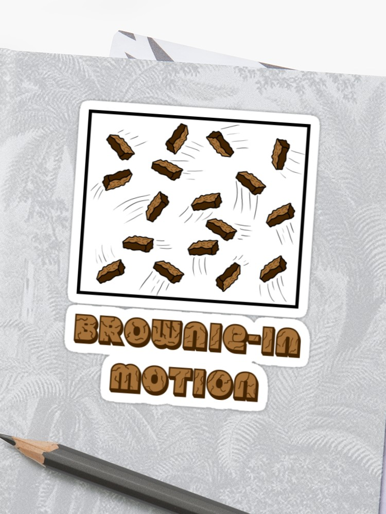

---
output:
  pdf_document: default
  html_document: default
---
# Foundations {#foundations}

```{r, echo = FALSE, message = FALSE, warning = FALSE}
# Load libraries (hidden)
library(ggtree)
library(ape)
library(caper)
library(tidyverse)
library(patchwork)
library(ggimage)
library(knitr)
library(measurements)
```

Before we use comparative methods, we need to understand some basic concepts about phylogenies, comparative data, and the models underlying them. In this chapter we will cover:

- Phylogenies.
    - Basic introduction.
    - How are phylogenies inferred?
    - Reading and using phylogenies.
- Comparative data
    - basics.
- Modelling continuous traits –
    - the Brownian Model. 
    - What if evolution is non Brownian?
- Modelling discrete traits.
    - ARD, ER, SYM
- Phylogenetic signal.


## A basic introduction to phylogenies 
At its simplest, a *phylogeny* or *phylogenetic tree* is a branching diagram that shows how species are related. The ancestor of all of the species is found at the *root* of the tree, with the species at the *tips*. The rest of the tree is made up of *nodes* and *branches*. Nodes show us where *speciation* events have occurred, i.e. where one species has evolved into two (or more) new species. The branches show the relationships among nodes and tips (Figure \@ref(fig:basic-tree)).

Most phylogenies are *rooted*, meaning that the ancestral node or *root* is identified. Phylogenies are rooted using an *outgroup*. The outgroup can be one or more species, and represents a species or group known to lie outside the group of interest, the *ingroup*. The root lies on the node that joins the outgroup to the ingroup. In an *unrooted* tree, no root is defined, meaning while we can look at the relationships among species, we cannot identify ancestral characteristics or how species change through time. This limits their usefulness, especially for comparative methods. 

Some phylogenies only show the *topology*, i.e. the shape of the relationships among the species. Most phylogenies, however, will have some information about the timing of branching events. In these phylogenies, *branch lengths* can represent absolute or relative time elapsed, or amounts of character change. Most of the phylogenies we use will be *dated phylogenies* (or *cladograms*), where the branch lengths represent divergence times. 

Note that throughout this section for simplicity we refer to "species" at the tips of phylogenies. In some cases, the tips will actually be genera or populations, or other operational taxonomic units (OTUs). Before beginning a comparative study, remember to check what the tips are in the phylogeny you are using.

```{r basic-tree, echo = FALSE, fig.cap='A simple phylogeny demonstrating the key features of phylogenetic trees.', out.width='80%', fig.asp=.75, fig.align='center'}

# Read in basic 4 species phylogeny
tree <- read.tree("data/basic.tre")

# Plot with images at tips
ggtree(tree) + 
  theme_tree() +
  # Change limits so labels fit
  xlim(-2, 22) +
  ylim(0, 5) +
  # Add tip label pictures
  geom_tiplab(aes(image = c("images/deer.png",
                            "images/robin.png",
                            "images/spider.png",
                            "images/jellyfish.png",
                            rep(NA, 3))), 
              geom = "image", align = TRUE, offset = 2.5, 
              linetype = NA, size = c(.12, .15, .09, .15)) +
  geom_tiplab(aes(label = c("tip",
                            "tip",
                            "tip",
                            "tip",
                            rep(NA, 3))), 
              geom = "text", align = TRUE, offset = 0.5,
              linetype = NA, size = 5) +
  # Add arbitrary root edge
  geom_rootedge(rootedge = 2) +
  # Add points at nodes
  geom_nodepoint(size = 2, col = "#fe4a49") +
  # Add node labels
  geom_nodelab(aes(subset = (node == 7), label = "node"), 
                    nudge_x = 1, nudge_y = 0, size = 5, col = "#fe4a49") +
  geom_nodelab(aes(subset = (node == 6), label = "node"), 
                    nudge_x = 1, nudge_y = 0, size = 5, col = "#fe4a49") +
  geom_nodelab(aes(subset = (node == 5), label = "node", col = "#fe4a49"), 
                    nudge_x = 1, nudge_y = 0, size = 5) +
  # Label branches
  geom_nodelab(aes(subset = (node == 5), label = "branch"), 
                    nudge_x = 6.5, nudge_y = -1, size = 5, col = "#2ab7ca") +
  geom_nodelab(aes(subset = (node == 5), label = "branch"), 
                    nudge_x = 3.5, nudge_y = 1, size = 5, col = "#2ab7ca") +
  geom_nodelab(aes(subset = (node == 6), label = "branch"), 
                    nudge_x = 3.5, nudge_y = -0.85, size = 5, col = "#2ab7ca") +
  geom_nodelab(aes(subset = (node == 6), label = "branch"), 
                    nudge_x = 1.5, nudge_y = 0.9, size = 5, col = "#2ab7ca") +
  geom_nodelab(aes(subset = (node == 7), label = "branch"), 
                    nudge_x = 2, nudge_y = -0.6, size = 5, col = "#2ab7ca") +
  geom_nodelab(aes(subset = (node == 7), label = "branch"), 
                    nudge_x = 2, nudge_y = 0.65, size = 5, col = "#2ab7ca") +
  # Add root label
  geom_nodelab(aes(subset = (node == 5), label = "root"), 
               nudge_x = -1.2, nudge_y = -0.2, size = 5, col = "#fed766") +
  
  # label outgroup and ingroup
  geom_cladelabel(node = 6 , label = "ingroup", offset = 6.25, 
                  fontsize = 5) +
  geom_cladelabel(node = 4 , label = "outgroup", offset = 6.25,
                  fontsize = 5) +
  theme(legend.position = "none")

```

To use phylogenies we need to understand a few more terms. These are also described in the Glossary (Chapter \@ref(glossary)) if you forget these at any point.

**Ultrametric**. Most of the phylogenies we will use in this book are *ultrametric* where all the branches end at the same place - the present-day (Figure \@ref(fig:ultrametric)A). If you are using phylogenies containing extinct species then the phylogeny will usually be *non-ultrametric* (Figure \@ref(fig:ultrametric)B). A key thing to remember when using phylogenies, especially ultrametric phylogenies of living species only, is that extinct species are missing. Exactly how large a problem this might be for comparative methods is unclear, because we can never know how many extinct species we are missing due to the patchiness of the fossil record. But it something we need to be aware of.


```{r ultrametric, echo = FALSE, fig.cap='Ultrametric (A) and non-ultrametric (B) phylogenies. In (B) the deer and spider have gone extinct before the present day.', out.width='80%', fig.asp=.75, fig.align='center'}

# Read in basic 4 species phylogeny
tree <- read.tree("data/basic.tre")
# Read in nonultrametric tree
non <- read.tree("data/nonultra.tre")

# Plot with images at tips
p1 <- 
  ggtree(tree) + 
  theme_tree() +
  # Change limits so labels fit
  xlim(0, 22) +
  ylim(0, 4) +
  # Add tip label pictures
  geom_tiplab(aes(image = c("images/deer.png",
                            "images/robin.png",
                            "images/spider.png",
                            "images/jellyfish.png",
                            rep(NA, 3))), 
              geom = "image", align = TRUE, offset = 0.5, 
              linetype = NA, size = c(.12, .15, .09, .15)) +
  labs(tag = "A")

p2 <- 
  ggtree(non) + 
  theme_tree() +
  # Change limits so labels fit
  xlim(0, 22) +
  ylim(0, 4) +
  # Add tip label pictures
  geom_tiplab(aes(image = c("images/deer.png",
                            "images/robin.png",
                            "images/spider.png",
                            "images/jellyfish.png",
                            rep(NA, 3))), 
              geom = "image", align = FALSE, offset = 0.5, 
              linetype = NA, size = c(.12, .15, .09, .15)) +
  labs(tag = "B", size = 2)

p1 + p2
```

**Polytomies**. The phylogenies we will use in this book will be *fully resolved*, i.e. each node will lead to two branches. This might not always be the case, however. When more than two branches originate from a node we call this a *polytomy* (Figure \@ref(fig:polytomy)B). Polytomies can be hard or soft. *Hard polytomies* represent the true evolutionary history of a group, often occurring where there has been rapid evolution. *Soft polytomies*, on the other hand, represent problems in phylogenetic inference (see below) where the methods cannot resolve the relationships among the species at that point. 

```{r polytomy, echo = FALSE, fig.cap='A fully resolved phylogeny (A) versus one with a polytomy (B). This polytomy suggests that the relationships among the deer, the robin and the spider are unresolved.', out.width='80%', fig.asp=.75, fig.align='center'}

# Read in basic 4 species phylogeny
tree <- read.tree("data/basic.tre")
# Read in polytomy tree
poly <- read.tree("data/polytomy.tre")

# Plot with images at tips
p1 <- 
  ggtree(tree) + 
  theme_tree() +
  # Change limits so labels fit
  xlim(0, 22) +
  ylim(0, 4) +
  # Add tip label pictures
  geom_tiplab(aes(image = c("images/deer.png",
                            "images/robin.png",
                            "images/spider.png",
                            "images/jellyfish.png",
                            rep(NA, 3))), 
              geom = "image", align = TRUE, offset = 0.5, 
              linetype = NA, size = c(.12, .15, .09, .15)) +
  labs(tag = "A")

p2 <- 
  ggtree(poly) + 
  theme_tree() +
  # Change limits so labels fit
  xlim(0, 22) +
  ylim(0, 4) +
  # Add tip label pictures
  geom_tiplab(aes(image = c("images/spider.png",
                            "images/deer.png",
                            "images/robin.png",
                            "images/jellyfish.png",
                            rep(NA, 2))), 
              geom = "image", align = FALSE, offset = 0.5, 
              linetype = NA, size = c(.12, .15, .09, .15)) +
  labs(tag = "B", size = 2)

p1 + p2
```
**Monophyly and clades**. A group of species that all share a common ancestor are referred to as a *monophyletic group* or a *clade* (Figure \@ref(fig:phyly)). Often, common taxonomic groupings e.g. mammals, are also monophyletic groups. Sometimes, taxonomic groups are nested within other taxonomic groups in a phylogeny, for example birds are nested within reptiles so that although birds are a monophyletic group, reptiles are a *paraphyletic group* (Figure \@ref(fig:paraphyly)). We can also have *polyphyletic groups* where the group members appear in multiple lineages across a phylogeny, for example the group formed by birds and mammals (Figure \@ref(fig:paraphyly)). 

```{r phyly, echo = FALSE, fig.cap='Phylogeny highlighting the monophyletic groups or clades. A is a clade made up of the deer and the robin. B is the more inclusive clade including the deer, the robin and the spider.', out.width='80%', fig.asp=.75, fig.align='center'}

# Read in basic 4 species phylogeny
tree <- read.tree("data/basic.tre")

# Plot with images at tips
ggtree(tree) + 
  theme_tree() +
  # Change limits so labels fit
  xlim(0, 22) +
  ylim(0, 5) +
  # Add tip label pictures
  geom_tiplab(aes(image = c("images/deer.png",
                            "images/robin.png",
                            "images/spider.png",
                            "images/jellyfish.png",
                            rep(NA, 3))), 
              geom = "image", align = TRUE, offset = 0.5, 
              linetype = NA, size = c(.12, .15, .09, .15)) +
  # Highlight clades
  geom_hilight(node = 6, fill = "cornflowerblue", alpha = 0.4) +
  geom_hilight(node = 7, fill = "springgreen", alpha = 0.4) +
  geom_cladelabel(node = 7 , label = "A", offset = 4,
                  fontsize = 5) +
  geom_cladelabel(node = 6 , label = "B", offset = 6,
                  fontsize = 5) 

```

```{r paraphyly, echo = FALSE, fig.cap='Phylogeny showing the relationships among birds, mammals and reptiles. Reptiles forms a paraphyletic group because birds is nested within it. The group formed by birds and mammals is a polyphyletic group.', out.width='80%', fig.asp=.75, fig.align='center'}

# Read in basic 4 species phylogeny
tree <- read.tree("data/reptile.tre")

# Define groups
# Note that ggtree does some weird ordering hence my "croc" and "robin" being 
# the wrong way round!
grp <- list(reptiles   = c("robin", "turtle", "lizard"),
            warm = c("crocodile", "deer"))

# Plot with images at tips
p <- 
  ggtree(tree) + 
  theme_tree() +
  # Change limits so labels fit
  xlim(0, 25) +
  ylim(0, 5) +
  # Add tip label pictures
  geom_tiplab(aes(image = c("images/crocodile.png",
                            "images/robin.png",
                            "images/lizard.png",
                            "images/turtle.png",
                           "images/deer.png",
                            rep(NA, 4))), 
              geom = "image", align = TRUE, offset = 3.5, 
           linetype = NA, size = c(.15, .12, .18, .07, .12)) +
  geom_tiplab(aes(label = c("crocodile",
                            "bird",
                            "lizard",
                            "turtle",
                            "mammal",
                            rep(NA, 4))), 
              geom = "text", align = TRUE, offset = 0.5, 
              linetype = NA) +
  geom_strip("1", "4", barsize = 2, color = "#fe4a49",
             label = "reptiles", offset = 8.5, offset.text = 0.5, geom = "text")

# Add phyly colours
groupOTU(p, grp, 'Species') + 
  aes(color = Species) +
  scale_colour_manual(values = c("#fe4a49","#2ab7ca")) +
  theme(legend.position = "none")

```

### Reading and interpreting phylogenies
We can read/interpret the phylogeny in Figure \@ref(fig:reading) as follows. **A** and **B** are each others' closest relatives. They share a *common ancestor* at node **X**. We can think of the branch leading to node X as the shared evolutionary history of A and B, while the branches leading from node **X** to **A** and **B** represents their independent evolution after speciation. **A** and **B** form a monophyletic group, or clade. They are also *sister species*. 

```{r reading, echo = FALSE, fig.cap='How to read a phylogenetic tree', out.width='80%', fig.asp=.75, fig.align='center'}
# Read in basic 4 species phylogeny
tree <- read.tree("data/basic.tre")

# Plot with images at tips
tree1 <-
  ggtree(tree) + 
  theme_tree() +
  # Change limits so labels fit
  xlim(0, 22) +
  ylim(0, 5) +
  # Add tip label pictures
  geom_tiplab(aes(image = c("images/deer.png",
                            "images/robin.png",
                            "images/spider.png",
                            "images/jellyfish.png",
                            rep(NA, 3))), 
              geom = "image", align = TRUE, offset = 3.5, 
              linetype = NA, size = c(.12, .15, .09, .15)) +
  geom_tiplab(aes(label = c("B",
                            "A",
                            "C",
                            "D",
                            rep(NA, 3))), 
              geom = "label", align = TRUE, offset = 0.5, 
              linetype = NA) +
  # Add points at nodes
  geom_nodepoint(size = 2) +
  # Add node labels
  geom_nodelab(aes(subset = (node == 7), label = "X"), 
                    nudge_x = 0.8, nudge_y = 0, size = 5) +
  geom_nodelab(aes(subset = (node == 6), label = "Y"), 
                    nudge_x = 0.8, nudge_y = 0, size = 5) +
  geom_nodelab(aes(subset = (node == 5), label = "Z"), 
                    nudge_x = 0.8, nudge_y = 0, size = 5) +
  labs(tag = "A", size = 2)

# Rotate tree
newtree <- rotate(phy = tree, 5)

# Plot with images at tips
tree2 <-
  ggtree(newtree) + 
  theme_tree() +
  # Change limits so labels fit
  xlim(0, 22) +
  ylim(0, 5) +
  # Add tip label pictures
  geom_tiplab(aes(image = c("images/robin.png",
                            "images/deer.png",
                            "images/spider.png",
                            "images/jellyfish.png",
                            rep(NA, 3))), 
              geom = "image", align = TRUE, offset = 3.5, 
              linetype = NA, size = c(.12, .15, .09, .15)) +
  geom_tiplab(aes(label = c("A",
                            "B",
                            "C",
                            "D",
                            rep(NA, 3))), 
              geom = "label", align = TRUE, offset = 0.5, 
              linetype = NA) +
  # Add points at nodes
  geom_nodepoint(size = 2) +
  # Add node labels
  geom_nodelab(aes(subset = (node == 7), label = "X"), 
                    nudge_x = 0.8, nudge_y = 0, size = 5) +
  geom_nodelab(aes(subset = (node == 6), label = "Y"), 
                    nudge_x = 0.8, nudge_y = 0, size = 5) +
  geom_nodelab(aes(subset = (node == 5), label = "Z"), 
                    nudge_x = 0.8, nudge_y = 0, size = 5) +
  labs(tag = "B", size = 2)

tree1 / tree2
```
Both **A** and **B** are equally closely related to **C**, as they all share a common ancestor at node **Y**. Note that **B** is **not** more closely related to **C** just because it is next to it at the tips. We could also represent the relationship as shown in the second panel with the branch leading to **B** and **A** rotated. 

Reading phylogenies is not always intuitive. Often this is due to how we represent them graphically. For example, each of the phylogenies in Figure \@ref(fig:diff-trees) shows the same relationships among species, but in different ways. By convention we usually present phylogenies with the __root at the left or the base of the phylogeny__ (like A, C, E, or G in Figure \@ref(fig:diff-trees)). 

```{r diff-trees, echo = FALSE, fig.cap = 'All of these phylogenies show the same species relationships, they are just presented in different ways', out.width='80%', fig.asp=.75, fig.align = 'left'}

# Read in basic 4 species phylogeny
tree <- read.tree("data/basic.tre")
# Rotate tree
newtree <- rotate(phy = tree, 5)

# Plot with images at tips
p <- 
  ggtree(tree) + 
  theme_tree() +
  # Change limits so labels fit
  xlim(0, 22) +
  ylim(0, 5) +
  # Add tip label pictures
  geom_tiplab(aes(image = c("images/deer.png",
                            "images/robin.png",
                            "images/spider.png",
                            "images/jellyfish.png",
                            rep(NA, 3))), 
              geom = "image", align = TRUE, offset = 1.5, 
              linetype = NA, size = c(.12, .15, .09, .15)) +
  labs(tag = "A", size = 2)

px <- 
  ggtree(tree) + 
  theme_tree() +
  scale_x_reverse(limits = c(22, 0)) +
  # Change limits so labels fit
  ylim(0, 5) +
  # Add tip label pictures
  geom_tiplab(aes(image = c("images/deer.png",
                            "images/robin.png",
                            "images/spider.png",
                            "images/jellyfish.png",
                            rep(NA, 3))), 
              geom = "image", align = TRUE, offset = -3.5, 
              linetype = NA, size = c(.12, .15, .09, .15)) +
  labs(tag = "B", size = 2)

pxx <-
  ggtree(tree) + 
  theme_tree() +
  coord_flip() +
  # Change limits so labels fit
  xlim(0, 22) +
  ylim(0, 5) +
  # Add tip label pictures
  geom_tiplab(aes(image = c("images/deer.png",
                            "images/robin.png",
                            "images/spider.png",
                            "images/jellyfish.png",
                            rep(NA, 3))), 
              geom = "image", align = TRUE, offset = 4, 
              linetype = NA, size = c(.12, .15, .09, .15), 
              hjust = 2) +
  labs(tag = "C", size = 2)


pxxx <-
  ggtree(tree) + 
  theme_tree() +
  coord_flip() +
  scale_x_reverse(limits = c(22, 0)) +
  # Change limits so labels fit
  ylim(0, 5) +
  # Add tip label pictures
  geom_tiplab(aes(image = c("images/deer.png",
                            "images/robin.png",
                            "images/spider.png",
                            "images/jellyfish.png",
                            rep(NA, 3))), 
              geom = "image", align = TRUE, offset = -4, 
              linetype = NA, size = c(.12, .15, .09, .15), 
              hjust = -2) +
  labs(tag = "D", size = 2)

p1 <- 
  ggtree(tree, layout = "slanted") + 
  theme_tree() +
  # Change limits so labels fit
  xlim(0, 22) +
  ylim(0, 5) +
  # Add tip label pictures
  geom_tiplab(aes(image = c("images/deer.png",
                            "images/robin.png",
                            "images/spider.png",
                            "images/jellyfish.png",
                            rep(NA, 3))), 
              geom = "image", align = TRUE, offset = 1.5, 
              linetype = NA, size = c(.12, .15, .09, .15)) +
  labs(tag = "E", size = 2)

p1x <- 
  ggtree(tree, layout = "slanted") + 
  theme_tree() +
  scale_x_reverse(limits = c(22, 0)) +
  # Change limits so labels fit
  ylim(0, 5) +
  # Add tip label pictures
  geom_tiplab(aes(image = c("images/deer.png",
                            "images/robin.png",
                            "images/spider.png",
                            "images/jellyfish.png",
                            rep(NA, 3))), 
              geom = "image", align = TRUE, offset = -3.5, 
              linetype = NA, size = c(.12, .15, .09, .15)) +
  labs(tag = "F", size = 2)

p1xx <-
  ggtree(tree, layout = "slanted") + 
  theme_tree() +
  coord_flip() +
  # Change limits so labels fit
  xlim(0, 22) +
  ylim(0, 5) +
  # Add tip label pictures
  geom_tiplab(aes(image = c("images/deer.png",
                            "images/robin.png",
                            "images/spider.png",
                            "images/jellyfish.png",
                            rep(NA, 3))), 
              geom = "image", align = TRUE, offset = 4, 
              linetype = NA, size = c(.12, .15, .09, .15), 
              hjust = 2) +
  labs(tag = "G", size = 2)

p1xxx <-
  ggtree(tree, layout = "slanted") + 
  theme_tree() +
  coord_flip() +
  scale_x_reverse(limits = c(22, 0)) +
  # Change limits so labels fit
  ylim(0, 5) +
  # Add tip label pictures
  geom_tiplab(aes(image = c("images/deer.png",
                            "images/robin.png",
                            "images/spider.png",
                            "images/jellyfish.png",
                            rep(NA, 3))), 
              geom = "image", align = TRUE, offset = -4, 
              linetype = NA, size = c(.12, .15, .09, .15), 
              hjust = -2) +
  labs(tag = "H", size = 2)

# Plot
(p + px) / (pxx+pxxx) / (p1 + p1x) / (p1xx+p1xxx)  

```

We can also use circular or fan shaped phylogenies (Figure \@ref(fig:fan-tree)) when we have large phylogenies that are hard to fit onto a page.

```{r fan-tree, echo = FALSE, fig.cap = 'An example of a fan or circular phylogeny. Tip labels have been omitted.', out.width='80%', fig.asp=.75, fig.align = 'left'}

# Read 
data(shorebird)

# Plot 
plot(shorebird.tree, type = "fan", no.margin = TRUE, show.tip.label = FALSE)
```

If you find reading and understanding phylogenies difficult, we highly recommend trying the *Tree Thinking challenge* at https://science.sciencemag.org/content/sci/suppl/2005/11/07/310.5750.979.DC1/Baum.SOM.pdf [@Baum979], which should help you get the hang of it.

### How do we infer phylogenies?
We could write a whole book just about inferring phylogenies. In fact, there already are several e.g. [@felsenstein2004inferring], and there will be another Primer focusing on this subject if it's something you need/want more details on! Here we will just cover the basics, focusing on the information you'll need to be able to understand the rest of the book.

Note that we **infer** phylogenies. We do not build or create them. This is because whatever clever methods we use, we can never truly know the evolutionary history of a group until someone invents a time machine!.

Most phylogenies are built using genetic or morphological data. Genetic data is usually a gene sequence, with the genes used depending on the question. For distinguishing relationships among close relatives, fast-evolving genes such as those in mitochondria or chloroplasts might be used, whereas protein-coding genes or whole genomes might be more appropriate for looking at relationships among ancient lineages. Collecting genetic data these days might be as simple as downloading it from GenBank, however, the sequences still need to be aligned which can take more time.

Morphological data is generally in the form of *cladistic matrices* where each character or trait of a species is coded as an integer. For example, a tail might be coded as 0 (absent) or 1 (present). Selecting characters for morphological phylogenies can be tricky, as they need to encompass the *synapomorphies* or unique characters that define clades in the tree, but the characters should also be independent of one another. Careful consideration of how characters should be coded is also needed, and this can vary from study to study.

Once the data have been collected they can be plugged into one of a number of software packages that will apply one or more phylogeny inference methods to output the "best" tree or trees. Here we will just mention the three most common inference methods: parsimony, Maximum Likelihood and Bayesian.

Note that one common feature of all phylogeny inference methods is that they are computationally intensive. Why? If you have three species, there are three possible ways those three species could be related in a fully-resolved tree. If we have ten species there are $34,459,425$ possible trees! If we have 50 species we have $2.75292 × 10^{76}$ possible trees (if you want to work this out for yourself, the equation used is $N_{trees} = (2n-3)!/2^{n-2} * (n-2)!$; [@felsenstein2004inferring]). To put that in context, that's more trees than there are stars in the sky, or grains of sand on Earth. That's a lot of trees... This means that no phylogenetic inference method can afford to search all of *tree space*, i.e. the universe of all possible trees. Instead, each method applies number of analytical tricks to avoid this, although we will not go into detail about this here. 

#### Parsimony
Parsimony has fallen out of favour as a method of phylogeny building in recent years, but it is still probably the best, and fastest, way to build phylogenies using morphological data. Parsimony works on the basis that the simplest solution is best, so the algorithms select the tree that accounts for the data with the fewest changes in character states across the tree, and outputs the *most parsimonious* phylogeny or phylogenies that satisfy that criterion. 

Ideally, this will result in one most parsimonious tree, but often more than one phylogeny meets this criterion. In these cases it is usual to create a *consensus tree*, an average topology across all the most parsimonious trees. There are several ways to construct these, from *strict consensus* trees that include only relationships shown in all most parsimonious trees, to *majority rule consensus* trees that include all relationships found in at least 50% of the most parsimonious trees. Consensus trees are one way that polytomies can be introduced into phylogenies (see Figure @ref(fig:poly)). 

BRANCH SUPPORT?

#### Maximum Likelihood (ML)
Maximum Likelihood is a statistical method for estimating the unknown parameters of a model. Likelihood is proportional to the probability of observing the data given the model, *P(data|model)*. The Maximum Likelihood solution is the one that has the highest Likelihood, i.e. the model that best describes the observed data. We will use Maximum Likelihood throughout this book to estimate parameters in many different types of models. 

In the case of phylogenetic inference, our model is the tree and an evolutionary model describing how the trait data (e.g. gene sequences or morphological characters) change. We therefore use Likelihood to calculate the probability of the observed trait data given the phylogeny and evolutionary model. The method selects the tree that best accounts for the data, i.e. the phylogeny or phylogenies with the Maximum Likelihood. 

Maximum Likelihood is considered to be a better phylogenetic inference method than parsimony for genetic data because we can explicitly define the underlying evolutionary model of DNA evolution, rather than just assuming the smallest number of changes gives the best tree. Remember that DNA is made up of four bases (cytosine [C], guanine [G], adenine [A] and thymine [T]), and these can be split into pyrimidines (C and T) and purines (A and G). Changes from C to T (and vice versa), or A to G (and vice versa), are called *transitions*, and these apear to be easier and thus occur at a higher rate than *transversions*, i.e. changes from C to A (and vice versa), or C to G (and vice versa), or T to A (and vice versa), or T to G (and vice versa). The frequencies of bases can also vary. Multiple models of DNA sequence evolution exist that take into account these various factors. The most commonly used are: 

- **JC**. Jukes Cantor [@jukes1969evolution]. This is the simplest model possible. All base changes are equally likely; base frequencies are equal. 
- **K2P**. Kimura 2 parameter [@kimura1980simple]. Transitions and transversions have different substitution rates; base frequencies are equal.
- **HKY85**. Hasegawa-Kishino-Yano-85 [@hasegawa1985dating]. Transitions and transversions have different substitution rates; base frequencies can vary.
- **GTR**. General Time Reversible [@lanave1984new]. All six types of base change (A to C, A to G, A to T, C to G, C to T, and G to T) occur at a different rate, and base frequencies vary.

Maximum Likelihood approaches can use any of these models, or any other model we might want to define. It is harder to come up with sensible, simple models of evolution for morphological data (although they do exist, for example the *Mkv* model; Lewis 2001), thus Maximum Likelihood approaches are used less often for morphological datasets. 

Maximum Likelihood approaches are very computationally intensive and can be very slow, certainly much slower than parsimony. Like parsimony, often more than one phylogeny has the same Maximum Likelihood so we construct consensus trees. 

#### Bayesian
Bayesian methods calculate the probability of the model given the data, *P(model|data)*, i.e. the reverse of Maximum Likelihood. In the case of Bayesian phylogenetic inference, we calculate the probability of the observed phylogeny given the trait data and the underlying evolutionary model. These models are the same as those used in Maximum Likelihood tree inference. 

The main difference between Bayesian approaches and both Maximum Likelihood and parsimony, is that we are no longer searching tree space for the "best" tree or trees. Instead, Bayesian methods output a *posterior distribution* of trees. The Bayesian method searches tree space, saving and outputting all trees it finds at regular intervals. This can result in thousands or even millions of possible trees. The user then specifies how many trees they would like to export as a posterior distribution of trees. This will consist of that number of trees, spread across the variety of trees inferred, but with the frequency of their occurence being based on their probability. For example, if your Bayesian method produces tree topologies A-Z, but topologies A-D are most common, the posterior distribution of trees will mirror that and will contain more trees with topologies A-D, than those with topologies E-Z.
 
The reasoning behind this is that phylogenetic inference is complex, so the probability of there being just one (or a few) trees that best represent the relationships among species is unlikely. With Bayesian approaches it is possible to get a clearer idea of *phylogenetic uncertainty*, and to actually incorporate this into our understanding of species relationships and downstream comparative analyses.

Because of the way posterior distributions are constructed, consensus trees are not appropriate for Bayesian phylogenies. Instead, we tend to run each analysis on the whole posterior distribution of trees, resulting in a posterior distribution of results. This can be a little more difficult to visualise, but gives a much better understanding of the effect of phylogenetic uncertainty on comparative analyses.

### Where do we get phylogenies from for comparative analyses?
Above we explain how phylogenies are inferred, but you have probably gathered by now that we are not experts in phylogenetic inference! So where do we get phylogenies from for comparative methods? The simple answer is the internet! Less flippantly, we get them from the published literature. Generally people publishing phylogenies will provide a NEXUS or Newick file containing their phylogeny as part of their supplementary materials. This is often a file ending in `.nex` or `.tre`. In the **online materials** we show you how to read these files into R, and explain more about how these files are structured. If an author has not provided their phylogeny in a format you can read into R (for example they may just have provided a PDF of the topology) you can email them and see if they are willing/able to give you a copy. Some researchers also store phylogenies in online databases such as [Treebase](https://www.treebase.org/). 

How do you choose the "best" phylogeny for your group? There is no hard or fast rule here, but we do recommend taking some time to think about this carefully. In some taxonomic groups you will have no choice as there may only be one existing phylogeny. In other groups you may be spoiled for choice. How you make the decision will also depend on how much you already know about the group in question. Some questions to ask that may guide you to the best phylogeny include:

- Given your knowledge of the group, does the taxonomy they have used and the characters used to infer the tree make sense? This may be particularly important for morphological trees, but it is also important to check they used an appropriate gene if using molecular trees.
- How many of your species are included in the phylogeny? You can add or remove species easily in R (see **online materials**), but if many species are missing it may be better to choose an alternative tree. You can also stitch together multiple trees (see **online materials**).
- What kind of method was used to infer the phylogeny? Does it seem appropriate to you? A phylogeny using genetic data but inferred using parsimony may ring alarm bells...
- Are the branches of the phylogeny well-supported? We didn't talk about branch support above, but you'll often see numbers above the nodes on a phylogeny. These tell you how well supported the relationships are, and generally range from 0-100 or 0-1. Good values will be close to 100 or 1 depending on the method used. 
- Are there lots of polytomies or is the phylogeny well-resolved? The methods we use in R can cope with polytomies (see **online materials**) but if there are more resolved phylogenies available these will be better.
- Can you access several different versions of the phylogeny, or a posterior distribution of phylogenies to account for phylogenetic uncertainty?
- If you don't know the group, or phylogenetics, well, don't be afraid to ask the opinion of someone who knows more than you. They may save you hours of pain and indecision!

### An important caveat

Hopefully this brief overview has revealed something important - inferring phylogenies is really difficult. We make many assumptions and choices at each stage of the process, from data collection to building consensus trees. As such, phylogenies are unlikely to give us the "true" evolutionary history of a group. Instead we can more accurately think of phylogenies as **hypotheses** about the way evolution happened. It is crucial to remember this when applying and interpreting comparative methods. Even if your comparative method is perfect in every way, you are still basing your analysis on a hypothesis about how species evolved. If this is incorrect, and it almost certainly is (due to missing extinct species etc.), then your results may not be as robust as you imagine.

```{block, type = "warning"}
Phylogenies are just **hypotheses** about the way evolution happened. Always bear this in mind when interpreting results from phylogenetic comparative methods.
```

## Comparative data

### Sources of comparative data and data quality
We have talked above about where we get phylogenies from, but what about the comparative data itself? There are a number of options and these will vary depending on your question and the data availability for your study group. Most comparative data will come from a range of sources, including peer-reviewed literature, books, field guides, internet searches, and curated databases. You can also collect some data from species in the field (e.g. behavioural data) or from museum specimens (e.g. morphological data). The quality of data from these different sources will vary, so care is needed. 

#### Peer-reviewed literature, books, field guides, and internet searches. 
The easiest way to collect comparative data is to sit in a library and work through all of the books and journals on your study group looking for the data you need. This is often a robust technique, as you can be fairly confident in the legitimacy of these sources, and for some groups these data have not yet been uploaded to the internet. It is also possible to do all of this using internet searches instead, but it is important to check the source of any information provided. Journal articles and professional webpages are likely to be fine, but other webpages may not always state the source of their information. You should be prepared to make judgment calls about whether you trust a particular source and want to include it in your dataset.

Collecting data manually reveals several issues common to most comparative data collection. It's a sensible idea to decide how you will deal with these issues should they arise. 

- Some sources will be more up-to-date than others. Should you record all the data from all sources, or just focus on the most recent?
- Some sources will give actual values whereas others will give approximations. Should you record any data you find, or remove approximations?
- Some data will be based on multiple individuals whereas others will be based on only one. 
- Some sources will list values as means, others will list values as maxima or minima. Will you record all of these or choose one?

There are of course many ways to do this, and as long as you **record the decisions you have made** so that someone could repeat the process if necessary, this is not a problem. Our recommendation is to record all data initially, along with some measure of data quality (low, medium or high is sufficient). You can still include this data either by incorporating measures of data quality into your analyses, or by excluding data below a certain data quality threshold when calculating summary data for the species. Finally it is extremely important to **record the sources** for each datum you add to your dataset, so that you are able to repeat the process if needed. This also allows you to remove data from any sources you later decide not to trust, and allows you to check individual data points if there are any issues, for example if one species appears as a large outlier in your comparative analyses this may reflect an error in data collection.

#### 
After collecting your data you'll likely need to summarise these data for each species, i.e. take the mean, median, minimum, maximum etc.

#### Curated databases
Curated databases are popular sources of comparative data. Some will be constantly added to as more data become available e.g. GBIF. Others are static, often because they were released as part of a published paper e.g. Meiri reptile dataset. These sources are popular because you can rapidly download data for a large number of species, making it much faster than going through books and literature manually. But just because a value is published in a database does not mean that it is reliable. The issues noted above still apply, and it is a good idea to check the data and sources of a database in the same way as for books or internet searches.

### Scientific method box: Practical data collection
How do we practically collect and record comparative data?

Let's imagine we have the following three sources of chameleon body size and life history data. 

**SOURCE 1: Smith et al 2020.** 

- *Chamaeleo chamaeleon*. 245mm, 80 eggs, sexually dimorphic.
- *Brookesia minima*. 33mm, 2 eggs, sexually dimorphic.
- *Calumma parsonii*. 650mm, 50 eggs, sexually dimorphic.

**SOURCE 2: Jones et al 2020.**

- *Chamaeleo chamaeleon*. Up to 250cm, Up to 100 eggs.
- *Brookesia minima*. Up to 34mm, 2 eggs.
- *Calumma parsonii*. Up to 695mm, Up to 50 eggs.

**SOURCE 3: Han et al 2020.**

- *Chamaeleo chamaeleon*. Approximately 10 inches.
- *Brookesia minima*. Approximately 1 inch.
- *Calumma parsonii*. Approximately 24 inches.

We would tend to record these data in a table (probably in Excel or another spreadsheet program) like this.
```{r, echo = FALSE}
x <- data.frame("Species" = c(rep("Chamaeleo chamaeleon", 3), 
                            rep("Brookesia minima", 3),
                            rep("Calumma parsonii", 3),
                            rep("Chamaeleo chamaeleon", 2), 
                            rep("Brookesia minima", 2),
                            rep("Calumma parsonii", 2),
                            "Chamaeleo chamaeleon", 
                            "Brookesia minima",
                            "Calumma parsonii"),
                "Measurement" = c(rep(c("length", "clutch size", "dimorphic"), 3),
                                  rep(c("length", "clutch size"), 3),
                                  rep("length", 3)),
                "Value" = c(245, 80, 1, 33, 2, 1, 650, 50, 1,
                            250, 100, 34, 2, 695, 50,
                            10, 1, 24),
                "Data_Type" = c(rep(c("mean", "mean", "truefalse"), 3),
                           rep(c("max"), 6),
                           rep("mean", 3)),
                "Units" = c(rep(c("mm", "eggs", "NA"), 3),
                            rep(c("mm", "eggs"), 3),
                            rep("inches", 3)),
                "Data_Quality" = c(rep("high", 9),
                             rep("high", 6),
                             rep("medium", 3)), 
                "Approximation" = c(rep(FALSE, 15),
                                    rep(TRUE, 3)),
                "Source" = c(rep("Jones et al 2020", 9),
                             rep("Smith et al 2020", 6),
                             rep("Han et al 2020", 3))
                             )

# Show whole table
kable(x, align = 'l')
```

We would also record the full reference for each source in a separate table. Recording the data like this makes it easy to enter in Excel, and also makes it easy for us to exclude certain types of data or sources should we decide we don't trust them enough to include in our analyses.

Note that this will not be the ideal format for using the data in R, so you will need to manipulate or *wrangle* the data first. In R, the `tidyr` and `dplyr` packages are useful for doing this. Or you could use something like Excel if you are less confident with R. Make sure to keep the raw data too in case you accidentally introduce any errors, and so that you can repeat the data collection and analyses if needed.

To wrangle this data, we would first convert the units to a standard unit for each measurement. Here we have length in mm and inches, so we would convert the inches into mm. The three altered rows are shown below. Note that converting from inches to mm gives us the false impression of precision, i.e. two values are now 25.4 and 609.6, rather than whole numbers making it look like these were measured accurately rather than approximated. It's worth looking out for this in other data, especially curated databases where this kind of conversion is typical.

```{r, echo = FALSE}
x2 <-
  x %>% 
  # Convert inches into mm
  mutate(Value = ifelse(Units == "inches", conv_unit(Value, "inch", "mm"), Value)) %>%
  # Remove units column
  select(-Units, - Source)

# Just show the last few entries
kable(tail(x2, n = 3), align = 'l')
```


Next we might decide to exclude low quality records, and remove any approximations. We might need to do something more complicated if we only have one record for a species and it is an approximation. In this case we are going to keep the approximations, and use all the data. But you should choose what is sensible for your dataset. 

Finally, we want to summarise the data for each species, to get means/medians and possibly also minima and maxima. It is up to you whether you use means or medians. Often we choose the median because it is less influenced by outliers. The summary data you use and how you calculate it will vary depending on your inputs for example here we might want to extract:

* *Median of mean length values*. This will tell us about the overall **mean** value for length across all sources.
* *Maximum of maximum length values*. This will tell us about the overall **maximum** value for length across all sources.
* *Median of mean clutch size values*. This will tell us about the overall **mean** value for clutch size across all sources.
* *Maximum of maximum clutch size values*. This will tell us about the overall **maximum** value for clutch size across all sources.
* *Median dimorphism score*. This will tell use whether the species is predominantly considered to be dimorphic or not.

Our final dataset for analyses might look something like this. 
```{r, echo = FALSE}
x3 <-
  x2 %>%
  select(-Data_Quality, -Approximation) %>%
  group_by(Species, Measurement, Data_Type) %>%
  summarise(median = median(Value),
                max = max(Value)) %>%
  pivot_wider(names_from = c(Measurement, Data_Type), values_from = c(median, max)) %>%
  select(Species, median_length = median_length_mean, max_length = max_length_max,
         median_clutchsize = `median_clutch size_mean`, max_clutchsize = `max_clutch size_max`,
         dimorphic = median_dimorphic_truefalse)

kable(x3, align = 'l') 
```  

Note that each variable is now its own column. This will help us when using the data in analysis programs like R. R code to acheive the above can be found in the *online materials*.


```{block, type = "warning"}
The results of comparative analyses are only as good as the data you put into them. Any choices you make in summarising the data need to be recorded and reported in your paper/thesis/report/supplementary material.
```

## Modelling continuous traits - the Brownian Motion model of evolution



At the very simplest level, comparative methods are interested in how traits change through time. The models we use to describe how traits change will vary depending on whether our traits are continuous (e.g. body size, leaf area) or discrete (presence or absence of a tail, growth form). For continuous traits, the most commonly used model is the Brownian motion model, and many more complex models have been built upon it. Therefore we will spend some time discussing it here.

```{block, type = "info"}
If equations scare you, don't panic! We are going to go through this a bit at a time. Read the full section then go back through it again to check your understanding.
```

The Brownian model (Cavalli-Sforza and Edwards, 1967; Felsenstein, 1973) is assumed to be the underlying mode of evolution in the majority of phylogenetic comparative methods (though this assumption is rarely tested; Freckleton and Harvey 2006). It can be fully described using just two parameters $z(0)$ and $\sigma^2$.

$z(0)$ is the starting value of the trait we are interested in. This is the mean value for the trait seen in the ancestral population before there have been any changes to the trait. $\sigma^2$

In the Brownian model, a trait $X$ evolves at random at a rate $\sigma$:

$dX(t) = \sigma dW(t)$

where $W(t)$ is a white noise function and is a random variate drawn from a normal distribution with mean 0 and variance $\sigma^2$. This model assumes that there is no overall drift in the direction of evolution (hence the expectation of $W(t)$ is zero) and that the rate of evolution is constant.

At the core of Brownian motion is the normal distribution. You might know that a normal distribution can be described by two parameters, the mean and variance. Under Brownian motion, changes in trait values over any interval of time are always drawn from a normal distribution with mean 0 and variance proportional to the product of the rate of evolution and the length of time (variance = σ2t). As I will show later, we can simulate change under Brownian motion model by drawing from normal distributions. Another way to say this more simply is that we can always describe how much change to expect under Brownian motion using normal distributions. These normal distributions for expected changes have a mean of zero and get wider as the time interval we consider gets longer.

Before we get into the technical statistical properties of the model, let's 

Brownian motion is the evolutionary rate parameter, σ2. This parameter determines how fast traits will randomly walk through time.


The Brownian motion model (Cavalli-Sforza and Edwards, 1967; Felsenstein, 1973) is assumed to be the underlying mode of evolution in the majority of phylogenetic comparative methods (though this assumption is rarely tested; Freckleton and Harvey 2006). 
In the model, a trait $X$ evolves at random at a rate $\sigma$:

$dX(t) = \sigma dW(t)$

where $W(t)$ is a white noise function and is a random variate drawn from a normal distribution with mean 0 and variance $\sigma^2$. This model assumes that there is no overall drift in the direction of evolution (hence the expectation of $W(t)$ is zero) and that the rate of evolution is constant.
Because the direction of change in trait values at each step is random, Brownian motion is often described as a “random walk” (note that you can also fit models where $W(t)$ is not zero and there is drift in the direction of evolution. 
This is known as the drift model, or Brownian motion with a trend. We will not cover this here).

The model assumes the correlation structure among trait values is proportional to the extent of shared ancestry for pairs of species. 
This means that close relatives will be more similar in their trait values than more distant relatives. 
It also means that variance in the trait will increase (linearly) in proportion to time.
The model has two parameters, the Brownian rate parameter, $\sigma^2$ and the state of the root at time zero, $X(0)$. 
`fitContinuous` estimates $\sigma^2$ and $X(0)$. 
Note that $\sigma^2$ can be used as a measure of the rate of trait evolution (Cooper and Purvis, 2010; Cooper et al., 2011).


The Brownian motion model is sometimes thought of as a "null model" of evolution 

    - What if evolution is non Brownian?

## Modelling discrete traits - simple models
    - ARD, ER, SYM


## Phylogenetic signal
Phylogenetic signal is the pattern where close relatives have more similar trait values than more distant relatives (see Kamilar and Cooper 2013). 


Note that often people will mention that they "corrected for phylogeny" because of the phylogenetic signal in their variables. However, we **do not** correct for phylogeny because our variables show phylogenetic signal. We account for phylogenetic non-independence because the **residuals** from our models show phylogenetic signal (see Revell 2010). $\lambda$ shown in PGLS models above is the $\lambda$ for the model residuals **not** the individual variables. 