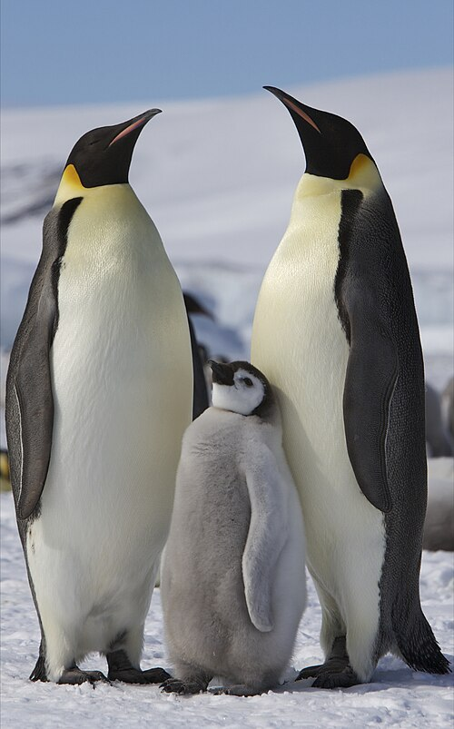

# Introduction to models of trait evolution {#foundations2}
```{r, echo = FALSE, message = FALSE, warning = FALSE}
# Load libraries (hidden)
library(ggtree)
library(ape)
library(caper)
library(reshape2)
library(tidyverse)
library(patchwork)
library(ggimage)
library(knitr)
library(measurements)
library(cowplot)
library(phytools)

# Helper functions for plotting
remove_y <- 
  theme(axis.line.y = element_blank(),
        axis.title.y = element_blank(),
        axis.text.y = element_blank(),
        axis.ticks.y = element_blank())
```

To apply phylogenetic comparative methods with confidence we need to understand the theory and models underpinning our methods. At the very simplest level, comparative methods are interested in how traits are distributed across phylogenies, and how these traits change through time. The models we use to describe how traits change will vary depending on whether our traits are *continuous* (e.g. body size, leaf area) or *discrete* (e.g. presence or absence of a tail, growth form, number of legs). This chapter introduces the *Brownian motion model of evolution*, which is commonly used to model continuous traits. It also describes simple models of discrete trait evolution, such as the *equal rates* and *all rates different models*. Finally we look at *phylogenetic variance covariance matrices*, a useful tool for future chapters.

## Modelling continuous traits - the Brownian Motion model of evolution

In section \@ref(section:infer) we explained how most types of phylogenetic inference rely on models of molecular evolution: the model allows us to estimate branch lengths by reconstructing the evolution of molecular changes. Similarly, comparative methods use models to analyse trait variation by expliciting including our understanding of evolution. We know that trait evolution happens through the accumulation of lots of small changes. As time progresses, these changes add up and the outcome is that closely related species tend to be similar, because fewer changes have happened, whereas distantly related species are more different because lots of change has accumulated (see Chapter \@ref(intro). Models of trait evolution are mathematical descriptions of evolutionary change that allow us to measure how fast traits evolve and, when we have several traits, how they coevolve. 

For continuous traits, the most commonly used model of trait evolution is the *Brownian motion model*, and many more complex models have been built upon it. Therefore we will spend some time discussing it here. If you're already familiar with the Brownian model you might want to skip to the summary at the end of the section just to check that you recall all the key features of the model. Otherwise, join me on an exploration of imaginary cats!

### An introduction to Brownian Motion

The Brownian model or BM model [@cavalli1967; @felsenstein1973maximum] is assumed to be the underlying mode of evolution in the majority of phylogenetic comparative methods [though this assumption is rarely tested; @freckelton2006detecting]. It can be fully described using just two parameters $z(0)$ and $\sigma^2$ (sigma squared).

$z(0)$ is the starting value of the trait we are interested in. This is the mean value for the trait seen in the ancestral population before there have been any changes to the trait. $\sigma^2$ is the rate at which evolution (i.e. trait change) occurs. Some of you might already be wondering why we use $\sigma^2$ here, as $\sigma^2$ is usually used to signify *variance*. And you'd be right, it is a variance! But how and why?

The Brownian model is a simple model of trait evolution and is what is known as a phenomenological model: it describes the evolution of continuous quantitative traits in an empirical way; it does not explicitly include the drivers or mechanisms of evolution, but it mathematically models the outcome in a simple way. The model assumes that traits are changing all of the time because of selective forces that drive changes. However the model assumes that overall selection is neutral in the sense that positive and negative changes in the trait are equally as likely. A common misconception is that this neutrality implies that evolution is not happening: quite the reverse! As you will see below, traits can change a lot when evolving in this way, it is just that there is no overall direction to the change. 

Here's the explanation of how it works. At the core of Brownian motion is the normal distribution (Figure \@ref(fig:normal)). In the Brownian motion model of evolution, the amount that a trait changes over any time interval is drawn at random from a normal distribution with a **mean of 0** and a **variance of $\sigma^2$**. Because the mean is 0, we can draw positive numbers causing the trait to increase, we can draw negative numbers causing the trait to decrease, and we expect the mean change in the trait over time to also be 0. How large these changes are depends on the value of $\sigma^2$. In Figure \@ref(fig:normal) you can see that as $\sigma^2$ gets larger, so does the spread of the normal distribution, meaning that large values are more likely to get drawn from the distribution as $\sigma^2$ increases, leading to larger increases or decreases in the value of the trait. This means evolution will be faster when $\sigma^2$ is larger. Because of this, $\sigma^2$ represents the *rate of evolution*, and is referred to as the *Brownian rate parameter*.

```{r normal, echo = FALSE, fig.cap='Three normal distributions with the same mean (0) but different variances.', out.width='80%', fig.asp=.75, fig.align='center'}
base_norm <- ggplot(data = data.frame(X = c(-3, 3)), aes(X)) +
  labs(x = "", y = "") +
  scale_y_continuous(breaks = NULL) +
  theme_cowplot() +
  remove_y +
  geom_vline(xintercept = 0, linetype = "dotted")

norm_0.1 <- 
  base_norm +
  stat_function(fun = dnorm, n = 101, args = list(mean = 0, sd = 0.3162278), color = "gold" )+
  labs(tag = "A") +
  annotate("text", label = "variance = 0.1", x = 2.5, y = 1.15, size = 5)

norm_0.25 <- 
  base_norm +
  stat_function(fun = dnorm, n = 101, args = list(mean = 0, sd = 0.5), colour = "cornflowerblue")+
  labs(tag = "B") +
  annotate("text", label = "variance = 0.25", x = 2.5, y = 0.75, size = 5)

norm_1 <- 
  base_norm +
  stat_function(fun = dnorm, n = 101, args = list(mean = 0, sd = 1), colour = "#fe4a49")+
  labs(tag = "C") +
  annotate("text", label = "variance = 1", x = 2.5, y = 0.35, size = 5)

(norm_0.1 / norm_0.25 / norm_1)

```

Because the direction of change in trait values at each step is random, Brownian motion is often described as a *random walk*.

Let's run a quick example simulation to see what is going on. Our trait can be any continuous feature of an organism, but for simplicity let's use body mass in (imaginary!) cats. First let's run one simulation to show how the body mass of one cat lineage changes through time under the Brownian model.

1. At the start, the trait value is $z(0)$. Here we'll start at $time = 0$ with an ancestral cat that weighs 4 kg. The rate of evolution, or Brownian rate parameter, $\sigma^2$, is 0.25 (like the normal distribution in Figure \@ref(fig:normal)B).

2. To determine the value for body mass at $time = 1$, we draw a random number from the normal distribution with $mean = 0$ and $\sigma^2 = 0.25$. In this example the value is $-0.1533193$. So the body mass of a cat at $time = 1$ is $4 + -0.1533193 = 3.84668$.

3. To determine the value for body mass at $time = 2$, we draw a random number from the normal distribution with $mean = 0$ and $\sigma^2 = 0.25$. In this example the value is $-0.89065422$. So the body mass of a cat at $time = 2$ is $3.84668 + -0.89065422 = 2.95603$, recall that $3.84668$ is the body mass at $time = 1$.

4. If we continue this until we get to $time = 10$ we get a graph that shows the evolution of the trait through time that looks like Figure \@ref(fig:cat1) (the numbers are the body mass values, rounded to two decimal places).

```{block, type = "detail"}
Hang on, where are we getting these random numbers from? We are just using R to extract numbers from a normal distribution with mean of 0 and variance of 0.25. If you want to try this out got to R and type in `rnorm(1, mean = 0, sd = sqrt(0.01))`. `sd` is standard deviation, which is the square root of variance. Note that these numbers are drawn at random so will not be the same as the values used above.
```

```{r cat1, echo = FALSE, fig.cap='A simple simulation showing how the body mass of cats changes through time under a Brownian model with $z(0) = 4 kg$ and $sigma^2 = 0.25$.', out.width='80%', fig.asp=.75, fig.align='center'}
# Create Brownian simulation data
#x <- c(20, rnorm(mean = 0, sd = 0.5, 10))
# Here we set the values so it always looks the same:
x <- c(20.00000000, -0.15331930, -0.89065422, -0.08595868,
       0.60733735,  0.94759673, -0.21523457, -0.12863469,
       0.88158154,  0.23004868, -0.31999744)

bmdata <- data.frame(time = 0:10, bmass = cumsum(x))

basic <- 
  ggplot(data = bmdata, aes(x = time, y = bmass)) +
  scale_y_continuous(breaks = c(18, 19, 20, 21), limits = c(18.5, 21.5), labels = c(2, 3, 4, 5)) +
  labs(x = "time", y = "body mass (kg)") +
  theme_cowplot() +
  geom_hline(yintercept = 20, linetype = "dotted") +
  scale_x_continuous(breaks = c(0:10), limits = c(0, 10.5)) +
  expand_limits(x = 0) +
  geom_point() +
  geom_line()

basic + 
  geom_label(aes(label = round(bmass-16, digits = 2)))
```

A few things to note. First, the direction of change is random, there is no trend towards increasing or decreasing body mass. Second, the changes do not depend on the changes that happened previously, i.e. an increase in body mass at time 1 does not mean an increase (or decrease) at time 2 is more or less likely. The random nature of trait changes is why the Brownian model is often referred to as a **random walk**. We sometimes describe it as being like a drunk person walking down the road, wobbling about but in no particular direction...

```{block, type = "info"}
Although our examples here use t = 1, t = 2 etc. to illustrate what is happening, Brownian motion is a continuous time process, and so time does not have discrete steps in the model.
```

The example above includes only one simulation to give you a basic idea of what is going on. To get a better idea of the patterns we expect to see, let's run 100 simulations instead, over a longer time period. Because the Brownian model is a random walk, we expect each simulation to be slightly different depending on the values drawn out of the normal distribution each time.
```{r, echo = FALSE}
# Create matrices with values from three BM simulations
# Define time and number of simulations 
t <- 1:99
nsim <- 100
# Define three different values for sig2
sig2_0.1 <- 0.1
sig2_0.25 <- 0.25
sig2_1 <- 1

# Create three different matrices of numbers drawn from a normal distribution with for different sig2. These will be the trait changes.
X_0.1 <- matrix(rnorm(n = nsim * (length(t) - 1), 
                       sd = sqrt(sig2_0.1)), nsim, length(t) - 1)
X_0.25 <- matrix(rnorm(n = nsim * (length(t) - 1), 
                   sd = sqrt(sig2_0.25)), nsim, length(t) - 1)
X_1 <- matrix(rnorm(n = nsim * (length(t) - 1), 
                      sd = sqrt(sig2_1 )), nsim, length(t) - 1)

# Use cumsum to get the trait values from the trait change matrices
sim_matrix_0.1 <- cbind(rep(0, nsim), 
                         t(apply(X_0.1 , 1, cumsum)))
sim_matrix_0.25 <- cbind(rep(0, nsim), 
                         t(apply(X_0.25 , 1, cumsum)))
sim_matrix_1 <- cbind(rep(0, nsim), 
                        t(apply(X_1 , 1, cumsum)))

# Make matrices into dataframes
sim_0.1 <- melt(sim_matrix_0.1)
sim_0.25 <- melt(sim_matrix_0.25)
sim_1 <- melt(sim_matrix_1)

# Rename variables
names(sim_0.1) <- c("sim", "time", "trait")
names(sim_0.25) <- c("sim", "time", "trait")
names(sim_1) <- c("sim", "time", "trait")

# Select only the tip values for histograms
sim_0.1_tips <- filter(sim_0.1, time == 99)
sim_0.25_tips <- filter(sim_0.25, time == 99)
sim_1_tips <- filter(sim_1, time == 99)
```

As above, we will start at $time = 0$ with an ancestral cat that weighs 4 kg (i.e. $z(0) = 4$), and use $\sigma^2$ of 0.25 as the rate of evolution (Figure \@ref(fig:bm100)A).

```{r bm100, echo = FALSE, warning = FALSE, message = FALSE, fig.cap='100 simulations showing how the body mass of cats changes through time under a Brownian model with $z(0) = 4 kg$ and $sigma^2 = 0.25$ (A); and a plot showing how variance in body mass across the simulations increases linearly through time (B).', out.width='80%', fig.asp=.75, fig.align='center'}
# Create base graph
base <-
  ggplot(sim_0.1, aes(x = time, y = trait, group = sim)) +
  labs(x = "time", y = "body mass (kg)") +
  theme_cowplot() +
  scale_y_continuous(breaks = c(-20, 0, 20), limits = c(-30, 30), labels = c(3,4,5) ) +
  scale_x_continuous(breaks = c(0,25,50,75,100), limits = c(0, 100)) +
  expand_limits(x = 0)

# Make line plots
p1 <-
  base +
  geom_line(data = sim_0.25, alpha = 0.25) +
  labs(tag = "A")


# Extract variances
vars <- 
  sim_0.25 %>%
  group_by(time) %>%
  summarise(var = var(trait))

# Plot variance through time
var_plot <-
  ggplot(vars, aes(x = time, y = var)) +
  labs(x = "time", y = "variance") +
  theme_cowplot() +
  scale_y_continuous(breaks = c(0,10,20), limits = c(0, 25)) +
  scale_x_continuous(breaks = c(0,25,50,75,100), limits = c(0, 100)) +
  expand_limits(x = 0) +
  geom_line() +
  labs(tag = "B")

p1 / var_plot
```

Notice how the variance in body mass (i.e. the spread of different values of body mass) *increases linearly with time* (it's not perfectly linear here, but it would be if we ran more simulations; Figure \@ref(fig:bm100)B). Meaning that body mass variance is greatest over the longest time intervals. In biological terms this means we expect to see more variance in the trait values of groups that have been evolving for longer.

If we vary the value of $\sigma^2$ we can look at the effect of changing the rate of evolution on the values of body mass we evolve in our cat simulations. If the rate of evolution is lower, then variance in body mass accumulates more slowly (Figure \@ref(fig:bmplots)A); if the rate of evolution is higher, then variance in body mass accumulates more quickly (Figure \@ref(fig:bmplots)C). The overall variance of the Brownian process is equal to the rate of evolution multiplied by the amount of time that has elapsed. 

```{r bmplots, message = FALSE, echo = FALSE, fig.cap='100 simulations showing how the body mass of cats changes through time under a Brownian model with $z(0) = 4 kg$ and (A) $sigma^2 = 0.1$; (B) $sigma^2 = 0.25$; (C) $sigma^2 = 1$.', out.width='80%', fig.asp=.75, fig.align='center'}
# Make line plots
plot_0.1 <-
  base + 
  geom_line(data = sim_0.1, alpha = 0.25) +
  labs(y = "")

plot_0.25 <-
  base + geom_line(data = sim_0.25, alpha = 0.25) +
  ylab("body mass (kg)")

plot_1 <-
  base + geom_line(data = sim_1, alpha = 0.25) +
  ylab("")

# Add normal distributions
norm_0.1 <- 
  base_norm +
  stat_function(fun = dnorm, n = 101, args = list(mean = 0, sd = 0.3162278), color = "gold" )+
  labs(tag = "A") +
  annotate("text", label = "var = 0.1", x = 2, y = 1.15, size = 5)

norm_0.25 <- 
  base_norm +
  stat_function(fun = dnorm, n = 101, args = list(mean = 0, sd = 0.5), colour = "cornflowerblue")+
  labs(tag = "B") +
  annotate("text", label = "var = 0.25", x = 2, y = 0.75, size = 5)

norm_1 <- 
  base_norm +
  stat_function(fun = dnorm, n = 101, args = list(mean = 0, sd = 1), colour = "#fe4a49")+
  labs(tag = "C") +
  annotate("text", label = "var = 1", x = 2, y = 0.35, size = 5)

(norm_0.1 + plot_0.1)/ 
  (norm_0.25 + plot_0.25) / 
  (norm_1 + plot_1)
```

One final feature to highlight is what the body mass values look like at the end of the simulations, i.e. where $t = 100$. If we assume that the present-day is $t = 100$, we can imagine that these values are equivalent to the body mass values for the species at the tips of our phylogeny. 

Because trait changes are drawn from a normal distribution with a mean of 0, on average we expect no change in body mass through time. So if we run enough simulations, the mean of the trait values at the end of the simulations should be equal to the starting value $z(0)$, in this case 4 kg. The rest of the values should be evenly distributed around the mean, so we expect the body mass values to be normally distributed. 

As demonstrated above, the variance of these normal distributions of body masses will depend on the rate of evolution (low rates result in smaller variances; high rates result in larger variances; Figure \@ref(fig:bmhist)) *and* the time elapsed (shorter times result in smaller variances; greater times result in larger variances; Figure \@ref(fig:bm100)). More precisely, we can define the overall variance of the Brownian process as the rate of evolution multiplied by the amount of time that has elapsed. 

```{r bmhist, echo = FALSE, warning = FALSE, fig.cap='Three Brownian motion simulations (left) with different values of sigma (A = 0.1, B = 0.25, C = 1) and the resulting trait distributions at the end of the simulation (right).', out.width='80%', fig.asp=.75, fig.align='center'}
# Now create histograms of trait values at tips
hist_0.1 <-
  ggplot(sim_0.1_tips, aes(x = trait)) +
  theme_void() +
  xlim(-30,30) +
  #ylim(0,65) +
  geom_histogram(bins = 12, fill = "gold", alpha = 0.8, colour = "black") +
  coord_flip()

hist_0.25 <-
  ggplot(sim_0.25_tips, aes(x = trait)) +
  theme_void() +
  xlim(-30, 30) +
  #ylim(0, 65) +
  geom_histogram(bins = 12, fill = "cornflowerblue", alpha = 0.8, colour = "black") +
  coord_flip()

hist_1 <-
  ggplot(sim_1_tips, aes(x = trait)) +
  theme_void() +
  xlim(-30, 30) +
  #ylim(0, 65) +
  geom_histogram(bins = 12, fill = "#fe4a49", alpha = 0.8, colour = "black") +
  coord_flip()

(plot_0.1 + ylab("") + labs(tag = "A") + hist_0.1 )/ 
  (plot_0.25 + ylab("body mass") + labs(tag = "B") + hist_0.25) / 
  (plot_1 + ylab("") + labs(tag = "C") + hist_1)
```

The examples above ignore the topology of the cat phylogeny - we are modelling a series of independent species, and we are not yet accounting for the inter-relationships between them. What if we want to model the evolution of cat body sizes across a branching phylogeny where species originate at different times? This is usually how we use the Brownian model, and it is very simple to extend. At each speciation event, we simply start a new Brownian simulation for the two new species. Let's do this with the cat example, assuming there are speciation events at time 3, 5, and 7, creating a phylogeny like the one in Figure \@ref(fig:bmcat). 

```{r, echo = FALSE}
# Read in cat phylogeny
tree <- read.tree("data/cat.tre")

# Plot tree
cattree <-   
ggtree(tree) + 
  theme_tree() +
  # Change limits so labels fit
  xlim(0, 25) +
  #ylim(0, 5) +
  geom_tiplab(aes(label = c("D",
                            "C",
                            "B",
                            "A",
                            rep(NA, 4)), colour = label), 
              geom = "label", align = TRUE, offset = 0.5, 
              linetype = NA) +
  # Add tip label pictures
  geom_tiplab(aes(image = c("images/cat.png",
                            "images/cat1.png",
                            "images/cat2.png",
                            "images/cat3.png", rep(NA, 4)), colour = label), 
              geom = "image", align = TRUE, offset = 4, 
              linetype = NA, size = c(.16, .19, .12, .11)) +
    scale_colour_manual(values = c("gold", "black", "cornflowerblue", "#fe4a49")) +
    theme(legend.position = "none")

```


```{r bmcat, echo = FALSE, fig.cap='A simulation showing how the body mass of four lineages of cats changes through time under a Brownian model with $z(0) = 4 kg$ and $sigma^2 = 0.25$ (A), and the phylogeny of the cats (B). The size of the cats indicates the final body size of the lineage in the simulation.', out.width='80%', fig.asp=.75, fig.align='center'}
# Create BM data for two new lineages
# Draw from distribution and add to start value
x2 <- c(18.87007, 0.2277251,  0.3524187,  
        0.5175518, -0.3044632,  0.2524776, 
        -0.8585043, 0.3922295)

x3 <- c(20.08113, 0.1029993, -0.1805286,  0.3790816)

x4 <- c(19.45021, -0.2157231,  0.3278239,  
        0.1609626, -0.3919195,  0.2878638)

# Make new datasets for new lineages
bmdata2 <- data.frame(time = 3:10, bmass = cumsum(x2))
bmdata3 <- data.frame(time = 7:10, bmass = cumsum(x3))
bmdata4 <- data.frame(time = 5:10, bmass = cumsum(x4))

# Plot
all <-
  basic +
  annotate(geom = "label", y = 20.87277, x = 10.5, label = "C") +
  geom_point(data = bmdata2, colour = "cornflowerblue") +
  geom_line(data = bmdata2, colour = "cornflowerblue") +
  annotate(geom = "label", y = 19.44951, x = 10.5, label = "B",
              color= "cornflowerblue") +
  geom_point(data = bmdata3, colour = "gold") +
  geom_line(data = bmdata3, colour = "gold") +
  annotate(geom = "label", y = 20.38268, x = 10.5, label = "D",
              color= "gold") +
  geom_point(data = bmdata4, colour = "#fe4a49") +
  geom_line(data = bmdata4, colour = "#fe4a49") +
  annotate(geom = "label", y = 19.7, x = 10.5, label = "A",
              color= "#fe4a49")

# Plot the tree and simulations
cattree + all +
  plot_layout(widths = c(1, 2))
```

There are a few things to note here looking at Figure \@ref(fig:bmcat) 

First, when a lineage speciates, the new lineages start at the same trait value, and over time they can evolve away from each other. This means that close relatives will be more similar in their trait values than more distant relatives, and differences in trait values between species will depend on how long ago they diverged from a common ancestor. For example, here we expect cat A and cat B to be more similar to one another than they are to cat C and cat D, and that cat A and cat B should be more similar to one another than cat C and cat D are to one another, because cat A and cat B diverged more recently than cat C and cat D (Figure \@ref(fig:bmcat)). More precisely, the correlation among trait values is proportional to the extent of shared ancestry for pairs of species. 

Second, we used the same normal distribution throughout to randomly draw our trait change values. This means that $\sigma^2$ was also the same throughout. This means that the *rate of evolution across the tree is constant*, i.e. it is the same for all the lineages. This is a big assumption of the Brownian model, and it is often broken in real life scenarios (for example the rapid evolution of clades in an *adaptive radiation*). We will return to this later in the book.

Finally, it's rare to see such simple examples of Brownian motion across trees as we've shown here. You're much more likely to see something like Figure \@ref(fig:phytools), drawn using the `phytools` R package. 

```{r phytools, echo = FALSE, fig.cap='A more complex simulation using 50 species, where z0 = 20, and sigma2 = 0.1.', out.width='80%', fig.asp=.75, fig.align='center'}

# Simulate a tree
treex <- rcoal(50, br = 5)
# Simulate some data
x <- fastBM(treex, sig2 = 0.1, a = 20, 
            internal = TRUE)
# Plot on the phenogram, without tip labels
phenogram(treex, x, ftype = "off", ylim = c(0,30))
```

What do the body mass values look like at the end of the simulations when we add the phylogeny? The expected distribution of the tips and nodes of the tree under Brownian motion is a __multivariate normal__ distribution with a __variance covariance matrix__, C, that is calculated using the phylogeny (see section \@ref(#section:varcovar) on variance covariance matrices). This is a really useful result, because it means that if we want to simulate data along a phylogeny under the Brownian motion model we don't need to do it along the branches as we demonstrated above. We can just sample data from the  multivariate normal distribution defined using the starting value, $z0$, $\sigma^2$, and the variance covariance matrix taken from the phylogeny. This speeds things up substantially.

Finally note that we don’t fit the models using the simple maths we’ve shown you above as it gets quite time consuming, instead we use Maximum Likelihood. Don’t worry about this for now as we will return to it later.

### A quick note about multivariate Brownian motion
Above we looked at the Brownian motion model of evolution using just one trait. But we’re often interested in how two or more traits evolve together across a phylogenetic tree. To model this we need to use multivariate Brownian motion models. These models are simple extensions of what we’ve discussed above, except we also consider how the two (or more) traits are correlated. As with just one trait, all trait values change randomly in both direction and magnitude. The two (or more) traits can be evolving independently of one another, or be correlated. We estimate the same parameters as for Brownian motion for one trait, and the end result is a set of traits with a multivariate normal distribution (rather than the univariate one shown in Figure \ref@{???}). We cover this in more detail in Chapter ???.

```{block, type = "info"}
To summarise the above, the key features of the Brownian motion model are: 

- Traits evolve at random, i.e. by a random walk.
- The direction and magnitude of the trait change at one time interval is independent of the direction and magnitude of the trait changes at other time intervals.
- There is no overall drift in the direction of evolution.
- Traits evolve at a rate $\sigma^2$.
- The rate of evolution is constant.
- Variance in traits increase (linearly) in proportion to time.
- The overall variance of the Brownian process is the rate of evolution times the amount of time that has elapsed. 

In terms of the model parameters:

- The model can be fully described using just two parameters $z(0)$ and $\sigma^2$.
- $z(0)$ is the starting value of the trait we are interested in. This is the mean value for the trait seen in the ancestral population before there have been any changes to the trait.
-  $\sigma^2$ is the rate at which evolution (i.e. trait change) occurs. It is also referred to as the Brownian rate parameter.

Some biological implications of the model are:

- Correlation among trait values is proportional to the extent of shared ancestry for pairs of species, i.e. close relatives are more similar than more distant relatives. 
- Different lineages evolve at the same rate.
```

```{block, type = "detail"}
**Is the Brownian motion model of evolution a realistic model of evolution?**
In this chapter we put a lot of effort into describing and explaining the Brownian model of evolution. But is it a realistic model of evolution? Before moving on, take some time to think about this. Two biological implications of the model are that (1) close relatives are more similar than more distant relatives; and (2) different species and lineages evolve at the same rate. Are these statements always true? Can you think of biological examples where this might not be the case? Think about adaptive radiations, key innovations, convergent evolution - do you expect evolution in these scenarios to be Brownian? 
What sorts of scenarios might be well modeled by Brownian motion? You've probably already realised that evolution is not always going to be Brownian. There are a number of other models of evolution, and we will return to these in *Chapter ?*.
```


## Modelling discrete traits - simple models

Many traits we are interested in studying are not continuous traits, instead they can be lumped into distinct categories, so we refer to them as discrete traits. Discrete traits have a number of states, and comparative methods can be used to investigate changes between states across a phylogeny. For example, if we are interested in the evolution of flightlessness in birds, we might want to know how many times this has evolved across the phylogeny, whether flying birds are more likely to evolve to be flightless, or whether flightless birds are more likely to evolve to fly, and whether flightless birds can ever evolve to fly again once they have lost the ability. 

In the flightlessness in birds example, we have two states: flying and flightless. We could also have intermediate states, e.g. semi-flightless. Traits can be ordered or unordered. Ordered traits have a set order of state changes, for example flying to semi-flightless to flightless. Unordered traits can change in any way. Traits can also be reversible or non-reversible, for example, if flightless bird lineages can never go on to evolve flight again, the trait is irreversible. The most simple way to model discrete traits is to assume that changes are unordered and reversible, so we will stick to this here. 

We've actually already met some models of discrete trait evolution over trees. Back when we discussed phylogenetic inference we mentioned several models of DNA sequence evolution, including the Jukes Cantor [@jukes1969evolution], and General Time Reversible (GTR) [@lanave1984new] models. The most basic models for discrete character evolution are analogues of these models.

### M*k*/Equal Rates model (ER)
The simplest model for discrete trait evolution is a direct analogue of the Jukes Cantor model. Except instead of changes in base pairs, we model changes in character states. We call this the M*k* model [@lewis2001likelihood; @pagel1994detecting]. The M stands for Markov, because the M*k* model assumes states change according to a Markov process, i.e. the probability of changing from one state to another is independent of what has happened previously, it only depends on the current state of the trait. The *k* is there because we generally use *k* to represent the number of parameters in a model. In models of discrete trait evolution, *k* is the number of states. For our flying/flightless example $k = 2$, for the flying/ semi-flightless/flightless example $k = 3$.   

In the M*k* model, all trait changes are equally likely, and all occur at the same rate. Because of this we often call the M*k* model the Equal Rates or ER model.

We can visualize the $Q$ (rate) matrix for an M*k* model of our flightlessness example like this:

-|flying|semi-flightless|flightless
--|--|--|--
flying|-|1|1
semi-flightless|1|-|1
flightless|1|1|-

The off-diagonals are the transition rates from state 1 to 2, 1 to 3, 2 to 1 and so on (read rows then columns). 
We typically designate individual transition rates in the form $q_ij$, which means the rate of going from state $i$ to state $j$. 
Here, the 1 in all off-diagonal elements represents the fact that rates are the same regardless of what state $i$ and $j$ are, and the direction of that change. 
The diagonal elements $q_ii$ give the rate of not changing and are computed as the negative sum of the non-diagonal row elements. 
This is so that the rows sum to zero. Here we've just left this as "-". 

In terms of biological assumptions, the ER model is probably too unrealistic: there is no good biological reason to expect that the transition between quite different states is the same. The Jukes-Cantor model was originally developed to model nucleotide substitutions, assuming that the frequencies of the nucleotide bases were the same, which seemed at the time (1969) to be a reasonable first assumption. However, subsequent data have shown that this is not the case (e.g. GC or TA biases are common).  Consequently this model probably has limited applicability. 

### Symmetric rates model (SYM)
In real data we have good reasons for thinking this might not be the case in many biological systems. Some changes in states are likely to be much easier than others, for example losing complex traits like eyes or limbs is likely to be easier than gaining them. The Mk model can be modified to allow for these more complex situations. The Symmetric rates (SYM) model (Paradis, Claude, and Strimmer 2004) is one such modification where the rate of change can differ among pairs of states, but within each pair of states the rate of change is the same in both directions. The number of different rates is three for k = 3. Using our flying/semi-flightless/flightless example, this means that the rate of change from flying to semi-flightless is exactly the same as the rate of change from semi-flightless to flying. However, these rates differ from the rate of change from flying to flightless (and vice versa), and also differ from the rate of change from semi-flightless to flightless (and vice versa). In terms of the DNA evolution models this is analogous to the GTR model (Lanave et al. 1984).

The $Q$ matrix for our flying/semi-flightless/flightless example looks like this:

-|flying|semi-flightless|flightless
--|--|--|--
flying|-|1|2
semi-flightless|1|-|3
flightless|2|3|-

It's worth noting that if you only have two states, i.e. $k = 2$, then the Symmetric model is exactly the same as the M*k*/Equal Rates model.

-|flying|flightless
--|--|--
flying|-|1
flightless|1|-

### All Rates Different (ARD) model
The final modification of the M*k* model we're going to cover here is the All Rates Different or ARD model [@paradis2004ape]. In this model not only does the rate of change differ among pairs of states, it can also differ within each pair of states depending on the direction of the change. For k states, we get $k^2 - k$ rates, which can be a pretty large number as k increases.

The $Q$ matrix for our flying/semi-flightless/flightless example looks like this:

-|flying|semi-flightless|flightless
--|--|--|--
flying|-|1|2
semi-flightless|3|-|4
flightless|5|6|-

Biologically, this is a useful model to fit if you think some of your states are not reversible, or very difficult to reverse, for example if you think the rate of evolution from flightless to flying is likely to be close to 0. It often works well for big complex datasets that span a variety of different states. For example, if you had a tree of all vertebrates and wanted to examine transition rates among different dietary strategies, this model would be worth examining.

You may have noticed that there is no analaogous model to ARD in DNA evolution. Molecular biologists don't use this kind of model because of potential *over-fitting* (see below), which is also a very important point to consider when chosing whether or not to fit an ARD model . It's also really important for some of the other methods we'll use later in the book, so I'll explain what I mean by over-fitting in the box below. If you're fitting an ARD model with six rates to a phylogeny containing only 30 species, you definitely need to stop and think about over-fitting. 

Case Study 3.1 gives an example using ER and ARD models to determine the ancestral litter size of bats (Garbino et al 2021).

```{block, type = "detail"}
### Beware of overfitting!


**Over-fitting** occurs where a model has more parameters than can be justified by the data. It can mean the model looks like it beautifully fits the data, but if you were to add additional data it would be useless. 

Imagine you have data on the swimming speed of ten penguins (let's call them Pingu, Pinga, Misha, Wheezy, Chilly Willy, Mumble, Skipper, Kowalski, Rico, Private and Feathers McGraw). You could fit a model (we could use a linear regression here) to see if body mass is correlated with swimming speed, and get a regression with an $r^2$ of 0.5. This suggests around half of the variance in swimming speed is explained by body mass. The other half might be explained by all kinds of things, including specific attributes of the particular penguins or errors in your measurements. We haven't fully explained variation in swimming speed, but it's still a useful model because if we weighed another penguin we'd have a reasonable chance of estimating roughly what its swimming speed might be from its body mass. 

If we wanted to increase the variance explained by the model as much as possible, we can start adding more variables. For example, maybe the faster penguins also have longer flippers so we add in flipper length. This might be sensible, and if we had more penguins in our dataset this would be fine. But what if we also add in a variable that accounts for Wheezy being slow due to his asthma, and another that accounts for Feathers McGraw being faster because he's evil? If we add enough variables, eventually we get to a model with an $r^2$ of 1. This means we can perfectly explain the swimming speed of our ten penguins, but we've got no hope of applying it to any new penguins we find. This is over-fitting, and the model not useful. Visually you can think of it the difference between fitting one line of best fit to a regression of X against Y, compared to joining all the points up.

There's no hard and fast rule about how much data you need to add another variable to your model, but some rules of thumb range from 20-30 data points for each variable. Complex models are always likely to fit data better just because they have more parameters, not necessarily because they mean anything biologically meaningful. You can avoid this problem by thinking very carefully about the models you chose to fit, why you think they are sensible, what you predict you will find, and how you will interpret the results, *before* fitting the model.
```

### A quick note about ancestral state estimation
You often hear about using phylogenies for *ancestral state reconstruction*, along with suggestions that these reconstructions can tell us what the ancestor of a group looked like, how it behaved, what it ate for breakfast etc. Sadly this is not as magical as it seems, and we should refer to this as ancestral state *estimation* NOT *reconstruction*. Ancestral state estimation is probably one of the most over-used and uninformative methods in the phylogenetic comparative methods toolkit. 

There are many reasons to be highly sceptical of ancestral state estimates and interpretations of macroevolutionary patterns and process that are based on them, not least because we know that phylogenies are only *hypotheses* and will often miss out large chunks of extinct diversity. Ancestral state estimation methods are based on the models we discussed above, meaning that your ancestral states are at best weighted averages of your trait based on branch lengths and the model used. How much trust you would want to put in such a result is up to you, but hopefully you now know enough to be very sceptical! However, certain phylogenetic comparative methods require that you define the state of the ancestor for them to work. We will return to this later in the book.

```{block, type = "warning"}
Ancestral state estimates (**not** reconstructions) are, at best, weighted averages of your trait based on branch lengths of the phylogeny and the model of evolution used. If your phylogeny or traits or model have error (and they always will) then your ancestral state estimates should be interpreted with care.
```

```{block, type = "examps"}
### Case Study: What was the litter size of the ancestral bat?
Most small mammals have more than one offspring at a time, with average litter sizes ranging from 4-7. Conversely, most bat species have only one offspring at a time (Figure CS3.1A), likely because of difficulties related to flying while pregnant and because offspring mortality is low in bats meaning there is selection for more investment in fewer offspring. Only bats in the Vespertilionidae family regularly have more than one offspring at a time. Garbino et al. (2021) were interested in how this pattern evolved. Did ancestral bats have multiple offspring (polytocy) and evolve to have only one offspring (monotocy)? Or did ancestral bats have one offspring with the Vespertilionidae later evolving to have more than one?

To test this, Garbino et al. (2021) used a phylogeny of 551 species of bats for which they had information on the litter size of the species. They coded litter size as a binary trait (polytocy or monotocy). Of the 551 bat species in the dataset, 74 (13.5%) were polytocous and 477 (86.5%) were monotocous. Next, they fitted Equal Rates (ER) and All Rates Different (ARD) models to the data. They used the Akaike Information Criterion (AIC) (see Chapter 6) to determine which of these models best fitted their data. Then they used the best fitting model to estimate whether polytocy or monotocy was more likely at the root of the tree, and at the root of Vespertilionidae. They also plotted the states onto the tree using stochastic character mapping (Figure CS3.1B).

<Figure CS3.1B near here>

Garbino et al. (2021) found the ARD model was a better fit than the ER model. Evolutionary transitions from monotocy to polytocy were rarer than transitions from polytocy to monotocy. Ancestral state estimations suggested that the ancestral state of modern Chiroptera was monotocy, but that polytocy was the ancestral condition in the family Vespertilionidae. This condition was subsequently lost in the ancestors of both the Myotinae and Kerivoulinae subfamilies.

Note that Garbino et al. (2021) also performed a number of other phylogenetic comparative methods (including tests for phylogenetic signal and PGLS models; see Chapter 4) which we have not tackled yet in this Primer. Check out the paper to find out more and to see their full results.
```

## Phylogenetic variance-covariance matrices {#section:varcovar}

A useful analytical tool that we will use in a number of methods in this *Primer* is to represent a phylogeny as a *phylogenetic variance–covariance matrix*. First let's think about what we mean by variance and covariance in the context of traits on phylogenies. To do this we need to go back to the Brownian motion model.

Remember that under Brownian motion, variance in a trait increases linearly in proportion to time. So species that diverged recently will have similar trait values, and species that diverged a long time ago will have very different trait values. In more technical terms we can say that the expected *covariance* between species’ trait values at the tips of the phylogeny is exactly proportional to the shared history of the species involved, i.e. the sum of their shared branch lengths. In addition, the expected *variance* of a trait value for a given species is proportional to total length of the tree, i.e. the summed branch length from the root to the tip for that species [19], also refered to as the *root-to-tip* distance. 

Figure \@ref(fig:roottotip) shows how we get the root-to-tip distances from a phylogeny. The letters a-f represent the branch lengths. Because this is an *ultrametric* tree, the root-to-tip distance for each species will be the same, i.e. the same amount of time has elapsed. So in the example in Figure \@ref(fig:roottotip), a *and* b + c *and* b + d + e *and* b + d + f all add up to the same number. Likewise, branch c is the same length as branches d + e, and branch e is the same length as branch f. Take a good look at the phylogeny in Figure \@ref(fig:roottotip) to make sure you understand this.

```{r roottotip, echo = FALSE, warning = FALSE, fig.cap='Phylogeny showing branch lengths and root-to-tip distances for each tip taxon', out.width='80%', fig.asp=.75, fig.align='center'}

# Read in basic 4 species phylogeny
tree <- read.tree("data/basic.tre")

# Plot with images at tips and root to tip distances
  ggtree(tree) + 
  theme_tree() +
  # Change limits so labels fit
  xlim(0, 25) +
  #ylim(0, 5) +
  # Add tip label pictures
  geom_tiplab(aes(image = c("images/deer.png",
                            "images/robin.png",
                            "images/spider.png",
                            "images/jellyfish.png",
                            rep(NA, 3))), 
              geom = "image", align = TRUE, offset = 1, 
              linetype = NA, size = c(.12, .15, .09, .15)) +
  # Label branches with lengths
  geom_nodelab(aes(subset = (node == 5), label = "a"), 
                    nudge_x = 6.5, nudge_y = -1, size = 5, col = "#2ab7ca") +
  geom_nodelab(aes(subset = (node == 5), label = "b"), 
                    nudge_x = 3.5, nudge_y = 1, size = 5, col = "#2ab7ca") +
  geom_nodelab(aes(subset = (node == 6), label = "c"), 
                    nudge_x = 3.5, nudge_y = -0.85, size = 5, col = "#2ab7ca") +
  geom_nodelab(aes(subset = (node == 6), label = "d"), 
                    nudge_x = 1.5, nudge_y = 0.9, size = 5, col = "#2ab7ca") +
  geom_nodelab(aes(subset = (node == 7), label = "e"), 
                    nudge_x = 2, nudge_y = -0.6, size = 5, col = "#2ab7ca") +
  geom_nodelab(aes(subset = (node == 7), label = "f"), 
                    nudge_x = 2, nudge_y = 0.65, size = 5, col = "#2ab7ca") +
  # Add root to tip calculations at tips
  geom_tiplab(aes(label = c("b + d + e",
                            "b + d + f",
                            "b + c",
                            "a",
                            rep(NA, 3))), 
              geom = "text", align = TRUE, offset = 5.5,
              linetype = NA, size = 8)
```

As already mentioned above, these root-to-tip values give us the variance of the trait across the tree. But what about the covariances among species, i.e. the shared branch lengths? We can extract these in the same way. The shared branch length between the robin and the deer is simply b + d (note that we don't include e or f because these branches only lead to either the robin *or* the deer). The shared branch length between the robin and the spider is b, because this is the only branch that leads towards them both. Likewise, the shared branch length between the deer and the spider is also b. The slightly tricky one is what is the shared branch length between the robin/deer/spider and the jellyfish? They don't share a branch at all in this phylogeny so we say their shared branch length is zero.

Why spend this time thinking about the trait variances and covariances? Because we know these values we can represent the phylogeny as a *phylogenetic variance–covariance matrix*. A phylogenetic variance–covariance matrix is an n x n matrix, where n is the number of species in the phylogeny, and the diagonals are the variances, and the off-diagonals are the covariances. For our example in Figure \@ref(fig:roottotip) the phylogenetic variance–covariance matrix looks like this.

-|robin|deer|spider|jellyfish|
robin|b+d+f|b+d|b|0|
deer|b+d|b+d+e|b|0|
spider|b|b|b+c|0|
jellyfish|0|0|0|a|

We will use phylogenetic variance–covariance matrices at various points in this *Primer*, including in the next section on phylogenetic signal in Chapter \@ref(signal). Often people mention these matrices (sometimes they will be referred to as phylogenetic vcvs) without explaining what they are, but hopefully the outline above has made them seem a bit less opaque and scary!

```{block, type = "info"}
As you may already be aware, variance–covariance matrices are used in many statistical methods, not just phylogenetic comparative methods. The fact that we can represent a phylogeny in this way will make our lives way easier in the next few chapters! 
```

## Chapter summary
- For continuous traits, the most commonly used model of trait evolution is the Brownian motion model.
- The key features of the Brownian motion model of evolution are (i) traits evolve at random, i.e. by a random walk; (ii) the direction and magnitude of the trait change at one time interval is independent of the direction and magnitude of the trait changes at other time intervals; (iii) there is no overall drift in the direction of evolution; (iv) traits evolve at a rate σ2; (v) the rate of evolution is constant; (vi) variance in traits increase (linearly) in proportion to time,; and (vii) the overall variance of the Brownian process is the rate of evolution times the amount of time that has elapsed.
- There are three basic models for discrete trait evolution: the Mk or Equal Rates model (ER), the Symmetric model (SYM) and the All Rates Different model (ARD). In the ER model, all rates of change between states are the same in both directions. In the SYM model, all rates of change between states are the same but differ according to the direction of change. In the ARD model is a unique rate of evolution for changes between different states in each direction. 
- Phylogenetic variance-covariance matrices are useful ways to represent phylogenies. A phylogenetic variance-covariance matrix is an n x n matrix, where n is the number of species in the phylogeny, the diagonals of the matrix are the variances, and the off-diagonals are the covariances. In a phylogeny the variance is the root-to-tip length of the tree. The covariances among species are the lengths of their shared branch lengths.

## Further reading
Classic text on using phylogenies and the Brownian motion model of evolution: Felsenstein, 1985. "Phylogenies and the comparative method." The American Naturalist 125.1: 1-15.

## Online exercises

- Preparing your tree and data for PCMs in R
- Phylogenetic Signal in R
- Models of evolution for continuous traits (also Chapter 7)
- Models of evolution for discrete traits (also Chapter 7)