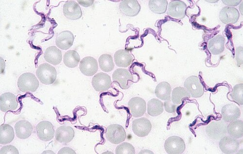

# Phylogenetic signal {#signal}
```{r, echo = FALSE, message = FALSE, warning = FALSE}
# Load libraries (hidden)
library(ggtree)
library(ape)
library(caper)
library(reshape2)
library(tidyverse)
library(patchwork)
library(ggimage)
library(knitr)
library(measurements)
library(cowplot)
library(phytools)

# Helper functions for plotting
remove_y <- 
  theme(axis.line.y = element_blank(),
        axis.title.y = element_blank(),
        axis.text.y = element_blank(),
        axis.ticks.y = element_blank())
```

Phylogenetic signal is one of the most commonly mentioned concepts in phylogenetic comparative methods. Unfortunately there's a lot of misunderstanding about what it is and what it means! Below we summarise what it is, how we can measure it, and how we can (and can't) interpret the results.

## What is phylogenetic signal?

*Phylogenetic signal* is the pattern where close relatives are more similar than distant relatives [@harvey1991comparative]. Species’ traits can show high or low phylogenetic signal. If phylogenetic signal is high, this means that closely related species have similar trait values, and that trait similarity decreases with phylogenetic distance. If phylogenetic signal is low, then trait values might vary randomly across a phylogeny, with distant relatives sharing similar trait values, and close relatives having different trait values [@kamilar2013phylogenetic]. 

```{block, type = "warning"}
You may see papers that use different terms to refer to phylogenetic signal, including phylogenetic effects, phylogenetic constraints and phylogenetic inertia. Unfortunately these terms are poorly defined and mean different things to different people. We therefore recommend that these terms are avoided.
```

## How do we estimate phylogenetic signal?

Like many of the methods we explore in this *Primer*, there are many different ways to estimate phylogenetic signal, each with their own strengths and weaknesses (see reviews by Munkemuller et al. [@munkemuller2012measure] and [@hardy2012assessing]). Here, we'll just focus on the two most commonly used metrics: **Pagel’s $\lambda$** [@freckleton2002phylogenetic; @pagel1999inferring; @pagel1997inferring] and **Blomberg’s *K* ** [@blomberg2003testing]. These metrics are for continuous characters only, so we also include one measure for binary data, **D** [@fritz2010selectivity], though this is less widely used. Practical examples of how to estimate these in R are provided in the *online materials*.

Both $\lambda$ and *K* use an explicit model of trait evolution - our old friend the Brownian motion model. If you've forgotten how this model works it might be worth re-reading this section before you begin.

### Pagel’s $\lambda$
Pagel’s $\lambda$ was introduced by Pagel [@pagel1997inferring; @pagel1999inferring] in the early 90s and is probably the most commonly used measure of phylogenetic signal. This is in part because $\lambda$ is not just a measure of phylogenetic signal, it is also often used to transform the branch lengths of a phylogeny for use in other analyses; we return to this in *Chapter 4*.

$\lambda$ transforms the branches of the phylogeny so that it best explains trait variation among species at the tips. For example, if species are less similar in their trait values than expected given their shared branch lengths, $\lambda$ transforms the tree so the branches are shorter. In practical terms, $\lambda$ transforms the *off-diagonal values*, or the covariances between pairs of species, of a phylogenetic variance–covariance matrix (see the section above). Remember that the covariances in a phylogenetic variance–covariance matrix are equal to the sum of the shared branch lengths of the species. In terms of the phylogeny, these covariances represent the internal branches of the tree. Importantly, $\lambda$ does not transform the variance of the tree, which we learned in the section above is equal to the root-to-tip distance or the total length of the tree. This means that the total length of the tree stays constant.

To make this clearer let's use our example from Figure \@ref(fig:roottotip) but let's add some numbers for the branch lengths (Figure \@ref(fig:vcv)). 

```{r vcv, echo = FALSE, warning = FALSE, fig.cap='Phylogeny showing branch lengths. The root-to-tip distances for each tip taxon are 13.6', out.width='80%', fig.asp=.75, fig.align='center'}

# Read in basic 4 species phylogeny
tree <- read.tree("data/basic.tre")

# Plot with images at tips and root to tip distances
  ggtree(tree) + 
  theme_tree() +
  # Change limits so labels fit
  xlim(0, 25) +
  #ylim(0, 5) +
  # Add tip label pictures
  geom_tiplab(aes(image = c("images/deer.png",
                            "images/robin.png",
                            "images/spider.png",
                            "images/jellyfish.png",
                            rep(NA, 3))), 
              geom = "image", align = TRUE, offset = 1, 
              linetype = NA, size = c(.12, .15, .09, .15)) +
  # Label branches with lengths
  geom_nodelab(aes(subset = (node == 5), label = "13.6"), 
                    nudge_x = 6.5, nudge_y = -1, size = 5, col = "#2ab7ca") +
  geom_nodelab(aes(subset = (node == 5), label = "6.3"), 
                    nudge_x = 3.5, nudge_y = 1, size = 5, col = "#2ab7ca") +
  geom_nodelab(aes(subset = (node == 6), label = "7.3"), 
                    nudge_x = 3.5, nudge_y = -0.85, size = 5, col = "#2ab7ca") +
  geom_nodelab(aes(subset = (node == 6), label = "3.1"), 
                    nudge_x = 1.5, nudge_y = 0.9, size = 5, col = "#2ab7ca") +
  geom_nodelab(aes(subset = (node == 7), label = "4.2"), 
                    nudge_x = 2, nudge_y = -0.6, size = 5, col = "#2ab7ca") +
  geom_nodelab(aes(subset = (node == 7), label = "4.2"), 
                    nudge_x = 2, nudge_y = 0.65, size = 5, col = "#2ab7ca") +
  # Add root to tip calculations at tips
  geom_tiplab(aes(label = c("6.3 + 3.1 + 4.2",
                            "6.3 + 3.1 + 4.2",
                            "6.3 + 7.3",
                            "13.6",
                            rep(NA, 3))), 
              geom = "text", align = TRUE, offset = 5.5,
              linetype = NA, size = 8)
```

Note that the root-to-tip distance for each species sums to 13.6. This is the variance, or diagonal of our phylogenetic variance–covariance matrix. The covariances, or off-diagonals, are the shared branch lengths between pairs of species. The shared branch length between the robin and the deer is 6.3 + 3.1 = 9.4. The shared branch length between the robin and the spider (and the deer and the spider) is 6.3. The shared branch length between the robin/deer/spider and the jellyfish is zero (see section above if this is not clear). Therefore, the phylogenetic variance–covariance matrix for this phylogeny is:

```{r, echo = FALSE}
kable(vcv(tree))
```

```{block, type = "info"}
$\lambda$ can be any number between 0 and 1. $\lambda$ of 0 indicates that there is no phylogenetic signal in the trait, i.e. that the trait has evolved independently of phylogeny and thus close relatives are not more similar on average than distant relatives. If $\lambda$ is 1 this indicates that there is strong phylogenetic signal, and the trait has evolved according to the Brownian motion model of evolution. 
```

What do $\lambda$ values of 0, 1 and anything in between, do to the phylogenetic variance–covariance matrix and the phylogeny?

When $\lambda$ is 0, all of the off-diagonal elements of the phylogenetic variance–covariance matrix are also 0 (any number multiplied by zero is equal to zero). In our example above (Figure \@ref(fig:vcv)) the phylogenetic variance–covariance matrix will look like this:

```{r, echo = FALSE}
m1 <- matrix(c(13.6, 0, 0, 0, 0, 13.6, 0, 0, 0, 0, 13.6, 0, 0, 0, 0, 13.6), nrow = 4)
colnames(m1) <- c("robin","deer", "spider", "jellyfish")
rownames(m1) <- c("robin","deer", "spider", "jellyfish")
kable(m1)
```

This means all the internal branches now have a length of zero. This produces a tree which is just one big polytomy, also refered to as a *star phylogeny* (Figure \@ref(fig:star)).

```{r star, echo = FALSE, warning = FALSE, fig.cap='Star phylogeny', out.width='80%', fig.asp=.75, fig.align='center'}

# Read star phylogeny
tree <- read.tree("data/star.tre")

# Plot with images at tips and root to tip distances
  ggtree(tree, layout = "slanted") + 
  theme_tree() +
  # Change limits so labels fit
  xlim(0, 1.5) +
  #ylim(0, 5) +
  # Add tip label pictures
  geom_tiplab(aes(image = c("images/deer.png",
                            "images/robin.png",
                            "images/spider.png",
                            "images/jellyfish.png", 
                             NA)), 
              geom = "image", align = TRUE, offset = 0.01, 
              linetype = NA, size = c(.12, .15, .09, .15))
```

When $\lambda$ is 1, all of the off-diagonal elements of the phylogenetic variance–covariance matrix are exactly the same (any number multiplied by 1 remains unchanged). In our example above (Figure \@ref(fig:vcv)) the phylogenetic variance–covariance matrix will look like this, i.e. the same as before the $\lambda$ transformation. The tree also stays the same as in Figure \@ref(fig:vcv).

```{r, echo = FALSE}
kable(vcv(tree))
```

```{block, type = "detail"}
Many explanations of Pagel's $\lambda$ state that the maximum value of $\lambda$ is 1. Actually, it can be bigger than 1 if close relatives are *more* similar than expected under the Brownian motion model of evolution. However, most tools that allow you to estimate $\lambda$ restrict it to a maximum of 1 because covariances cannot exceed variances in a phylogenetic variance–covariance matrix, and this is what would happen if $\lambda$ was bigger than 1.
```

Values of $\lambda$ between 0 and 1 indicate that although there is phylogenetic signal in the trait, it has evolved according to a process other than pure Brownian motion [@freckleton2002phylogenetic]. We'll discuss how to interpret phylogenetic signal in more detail later in this section. But to show you how this affects the phylogenetic variance–covariance matrix and the tree, let's assume a $\lambda$ of 0.5. This will multiply all the off-diagonal elements of the phylogenetic variance–covariance matrix by 0.5 resulting in a tree as shown in Figure \@ref(fig:lambda05), and a matrix like this:

```{r, echo = FALSE}
m2 <- matrix(c(13.6, 4.7, 3.15, 0, 4.7, 13.6, 3.15, 0, 3.15, 3.15, 13.6, 0, 0, 0, 0, 13.6), nrow = 4)
colnames(m2) <- c("robin","deer", "spider", "jellyfish")
rownames(m2) <- c("robin","deer", "spider", "jellyfish")
kable(m2)
```


```{r lambda05, echo = FALSE, warning = FALSE, fig.cap='Phylogeny showing branch lengths in the original tree and a transformed tree where lambda = 0.5. The root-to-tip distances for each tip taxon are 13.6', out.width='80%', fig.asp=.75, fig.align='center'}

# Read in basic 4 species phylogeny
tree <- read.tree("data/basic.tre")

# Plot original tree
original <- 
  ggtree(tree) + 
  theme_tree() +
  # Change limits so labels fit
  xlim(0, 25) +
  #ylim(0, 5) +
  # Add tip label pictures
  geom_tiplab(aes(image = c("images/deer.png",
                            "images/robin.png",
                            "images/spider.png",
                            "images/jellyfish.png",
                            rep(NA, 3))), 
              geom = "image", align = TRUE, offset = 1, 
              linetype = NA, size = c(.12, .15, .09, .15)) +
  # Label branches with lengths
  geom_nodelab(aes(subset = (node == 5), label = "13.6"), 
                    nudge_x = 6.5, nudge_y = -1, size = 5, col = "#2ab7ca") +
  geom_nodelab(aes(subset = (node == 5), label = "6.3"), 
                    nudge_x = 3.5, nudge_y = 1, size = 5, col = "#2ab7ca") +
  geom_nodelab(aes(subset = (node == 6), label = "7.3"), 
                    nudge_x = 3.5, nudge_y = -0.85, size = 5, col = "#2ab7ca") +
  geom_nodelab(aes(subset = (node == 6), label = "3.1"), 
                    nudge_x = 1.5, nudge_y = 0.9, size = 5, col = "#2ab7ca") +
  geom_nodelab(aes(subset = (node == 7), label = "4.2"), 
                    nudge_x = 2, nudge_y = -0.6, size = 5, col = "#2ab7ca") +
  geom_nodelab(aes(subset = (node == 7), label = "4.2"), 
                    nudge_x = 2, nudge_y = 0.65, size = 5, col = "#2ab7ca")

# Read in phylogeny where lambda = 0.5
tree <- read.tree("data/lambda05.tre")

# Plot lambda = 0.5 tree
lambda05 <- 
  ggtree(tree) + 
  theme_tree() +
  # Change limits so labels fit
  xlim(0, 25) +
  #ylim(0, 5) +
  # Add tip label pictures
  geom_tiplab(aes(image = c("images/deer.png",
                            "images/robin.png",
                            "images/spider.png",
                            "images/jellyfish.png",
                            rep(NA, 3))), 
              geom = "image", align = TRUE, offset = 1, 
              linetype = NA, size = c(.12, .15, .09, .15)) +
  # Label branches with lengths
  geom_nodelab(aes(subset = (node == 5), label = "13.6"), 
                    nudge_x = 6.5, nudge_y = -1, size = 5, col = "#2ab7ca") +
  geom_nodelab(aes(subset = (node == 5), label = "3.15"), 
                    nudge_x = 1, nudge_y = 1, size = 5, col = "#2ab7ca") +
  geom_nodelab(aes(subset = (node == 6), label = "10.45"), 
                    nudge_x = 5, nudge_y = -0.85, size = 5, col = "#2ab7ca") +
  geom_nodelab(aes(subset = (node == 6), label = "1.55"), 
                    nudge_x = -0.5, nudge_y = 0.9, size = 5, col = "#2ab7ca") +
  geom_nodelab(aes(subset = (node == 7), label = "8.9"), 
                    nudge_x = 4, nudge_y = -0.6, size = 5, col = "#2ab7ca") +
  geom_nodelab(aes(subset = (node == 7), label = "8.9"), 
                    nudge_x = 4, nudge_y = 0.65, size = 5, col = "#2ab7ca")

original + lambda05
```

Understanding what has happened to the branch lengths in Figure \@ref(fig:lambda05) is a little tricker. Remember that $\lambda$ only acts on the off-diagonals/covariances of the matrix. These are the *internal* branches of the phlyogeny, i.e. not the branches that lead to the tips. If $\lambda$ is less than 1, this means that those branches get shorter. Here The internal branch lengths have all been halved because $\lambda$ = 0.5. 

However, we also know that $\lambda$ does not act on the diagonal/variances of the matrix that represents the total tree length. If total tree length does not change, but internal branches get shorter, then the branches leading to the tips must get longer. Here to ensure the root-to-tip distance for each species is still 13.6, the branches leading to the robin/deer need to be 8.9 (13.6 - 4.7), and the branch leading to the spider needs to be 10.45 (13.6 - 3.15).

We generally estimate $\lambda$ using Maximum Likelihood. This means that for a given trait and phylogeny, we search for the value of $\lambda$ that best explains trait variation among species at the tips of the phylogeny, i.e. the Maximum Likelihood value of $\lambda$. We can test if $\lambda$ is significantly different from zero (i.e. no phylogenetic signal) or 1 (i.e. the Brownian motion model expectation) using likelihood ratio tests comparing a model with the observed Maximum Likelihood value of $\lambda$ to a model with a fixed $\lambda$ of zero or 1. Some methods that estimate $\lambda$ will do this for us automatically (e.g. in the `pgls` function in the R package `caper` [@Orme:2013aa]; see *online supplement*).

### Blomberg’s *K*
Rather than transforming the tree like $\lambda$, Blomberg’s *K* instead measures phylogenetic signal by quantifying the amount of observed trait variance relative to the trait variance expected under Brownian motion [@blomberg2003testing]. It's a little tricky to explain how *K* is estimated, especially in advance of *Chapter 4* which introduces you to phylogenetic generalised least squares (PGLS) models. However, you should be able to understand the general concepts without needing to know the mathematical details. We will first talk about *K* in very general terms, and then explain how it is estimated in more detail. You don't need to understand the maths to use *K* in your work, but it's good practice to try. 

The equation for Blomberg’s *K* is:

\begin{equation} 
  K = \frac{observed \frac{MSE_0}{MSE}} {expected \frac{MSE_0}{MSE}}
  (\#eq:K)
\end{equation} 

The important part of the equation to think about initially is the $observed \frac{MSE_0}{MSE}$ part. $MSE_0$ is the mean squared error (MSE) of the tip data in relation to the phylogenetic mean of the data. $MSE$ is the mean squared error  of the tip data in relation to the phylogenetic variance covariance matrix. We explain both of these in more detail below. The important points to take away are:

- if trait similarities are well explained by the phylogeny, observed $MSE$ will be *small* so the ratio of observed $MSE_0$ to $MSE$ will be *large*, and so will *K*. 
- if trait similarities are *not* well explained by the phylogeny, observed $MSE$ will be *large* so the ratio of observed $MSE_0$ to $MSE$ will be *small*, and so will *K*. 
- the $observed \frac{MSE_0}{MSE}$ is divided by the expected value under Brownian motion to standardise it because $observed \frac{MSE_0}{MSE}$ will vary depending on the trait and the tree.

```{block, type = "info"}
*K* varies continuously from zero to infinity. When *K* is 0, this indicates that there is no phylogenetic signal in the trait (i.e. close relatives are not more similar on average than distant relatives). This is the equivalent of $\lambda = 0$. When *K* is 1, this indicates that the trait has evolved according to the Brownian motion model of evolution, just like when $\lambda$ is 1. Finally, where where K is greater than 1 this indicates that close relatives are more similar than expected under a Brownian motion model of trait evolution (see interpretation notes below). The maximum value of *K* will vary depending on the trait and the tree involved. 
```

We can test whether *K* is significantly different from 0 using randomisation tests. These work by randomizing the trait data across the phylogeny, calculating *K*, and then repeating this 1000 times. If we have phylogenetic signal in our data we expect these random *K* values to have lower values than our value of *K*. We can get a p value for the randomisations by counting how many times the randomised trait data gives a higher value of *K* than our observed value, and then dividing this by the total number of randomisations. For example, if 10 randomised *K* values are higher than the observed *K* then p = 10/100 = 0.01. 

```{block, type = "detail"}
### How do we estimate Blomberg’s *K*?

Let's use a very simple example with just three taxa, A, B and C. For more details and proper maths (!) see [@blomberg2003testing].
```

```{r Ktree, echo = FALSE, warning = FALSE, fig.cap='Phylogeny showing branch lengths and body size for each tip taxon', out.width='80%', fig.asp=.75, fig.align='center'}

# Read in Ktree phylogeny
tree <- read.tree("data/Ktree.tre")

# Plot with images at tips and root to tip distances
  ggtree(tree) + 
  theme_tree() +
  # Change limits so labels fit
  xlim(0, 10) +
  #ylim(0, 5) +
  # Add tip label pictures
  geom_tiplab(aes(label = c("B = 4 kg", "A = 2 kg", "C = 11 kg", NA, NA)), 
              geom = "text", align = TRUE, offset = 1, size = 6,
              linetype = NA) +
  # Label branches with lengths
  geom_nodelab(aes(subset = (node == 4), label = "2"), 
                    nudge_x = 4.5, nudge_y = 1.5, size = 5, col = "#2ab7ca") +
  geom_nodelab(aes(subset = (node == 4), label = "2"), 
                    nudge_x = 4.5, nudge_y = 0.45, size = 5, col = "#2ab7ca") +
  geom_nodelab(aes(subset = (node == 5), label = "5.5"), 
                    nudge_x = -1.5, nudge_y = -1.25, size = 5, col = "#2ab7ca") +
  geom_nodelab(aes(subset = (node == 5), label = "3.5"), 
                    nudge_x = -1.5, nudge_y = 0.25, size = 5, col = "#2ab7ca")
```

```{block, type = "detail"}
As we noted above the equation for Blomberg’s *K* is: 

\begin{equation} 
  K = \frac{observed \frac{MSE_0}{MSE}} {expected \frac{MSE_0}{MSE}}
\end{equation} 

Before we think about the equation we should remind ourselves what we mean by *mean squared error (MSE)*. MSE is a way of looking at how far away the data are from the mean. If we have five species with body sizes of 5, 10, 15, 20, 25, the mean body size will be 15 ($\frac{5 + 10 + 15 + 20 + 25}{5}$). The *error* (E) is how far from the mean the observed values are (this is equivalent to the residuals in a model). Here the errors will be -10 (i.e. $5 - 15$), -5, 0, 5 and 10. If we sum all of these we end up with 0 as the negative and positive numbers cancel each other out, so to solve this problem we *square* (S) them to give 100, 25, 0, 25 and 100. Finally we take the *mean* (M) of this number to get 50. That's the MSE! If the values are clustered around the mean the MSE will be low. If they are spread out the MSE will be high.

This calculation might seem familiar, and that's because it's the same way we estimate variance! 

Note that above when we calculated the mean part of MSE/variance we divided by $n$, where $n$ is the number of observations. However, this is only valid where we are looking at the whole population. If instead, as is common in phylogenetic comparative methods, we are looking at a *sample* of the whole population, we instead divide by $n - 1$. Why do we do this? In simple terms, if we are looking at a sample rather than the whole population, the MSE/variance we calculate will contain a little bit of bias. Subtracting 1 from the sample size corrects this bias, so you’ll usually get a more accurate answer if you use $n - 1$ instead of $n$ (if you want more details this is known as Bessel’s correction).

Now let's consider just the observed $\frac{MSE_0}{MSE}$ part of the equation for *K*. 

$MSE_0$ is the mean squared error (MSE) of the tip data in relation to the phylogenetic mean of the data. This is exactly the same as the MSE described above, but instead of using the mean calculated in the normal way, we use the phylogenetic mean, i.e. the mean value if we account for shared evolutionary history of the species involved. A simplified equation for this is as follows, where $X$ is the trait data, $a$ is the phylogenetic mean, and $n$ is the sample size.

\begin{equation} 
  MSE_0 = \frac{\Sigma(X - a)^2}{n - 1}
\end{equation} 

The phylogenetic mean of the data is equivalent to the estimated trait value at the root, so we can obtain this using ancestral state estimation. See *Chapter 4* and the online materials for more information on how this works. 

For our example, the phylogenetic mean $a$ is 6.6 kg. Values of $X$ are 2, 4 and 11 kg, and $n$ is 3. This means that our $MSE_0$ is 23.64:

\begin{equation} 
  MSE_0 = \frac{(2 - 6.6)^2 + (4 - 6.6)^2 + (11 - 6.6)^2}{3 - 1} = 23.64
\end{equation} 

$MSE_0$ will vary in magnitude depending on how far the data are from the phylogenetic mean. But in a situation where close relatives tend to be more similar than distant relatives, i.e. the phylogeny gives us some information about the covariances among species trait values, it will be larger than $MSE$.

$MSE$ is the mean squared error extracted from a *phylogenetic generalized least-squares (PGLS) model* that uses the phylogenetic variance–covariance matrix in its error structure. We cover PGLS models in *Chapter 4*, but for now it's enough to know that rather than using $X$ we use $U$ which is the trait values transformed according to the phylogenetic variance–covariance matrix.

\begin{equation} 
  MSE = \frac{\Sigma(U - a)^2}{n - 1}
\end{equation}

In a PGLS context, $(U - a)$ are equivalent to the phylogenetic residuals from a PGLS model. 

Here the values of $U$ are 7.219543, 4.902944 and 8.633757. $a$ is still 6.6, and $n$ is still 3, thus

\begin{equation} 
  MSE = \frac{(7.219543 - 6.6)^2 + (4.902944 - 6.6)^2 + (8.633757 - 6.6)^2}{3 - 1} = 3.7
\end{equation} 

As predicted, $MSE$ is much smaller than $MSE_0$ because it includes the information about the phylogeny.

We can now calculate observed $\frac{MSE_0}{MSE} = \frac{23.64}{3.7} = 6.389189$ 

Finally, to make values of *K* comparable among different phylogenies, the observed $MSE_0$ to $MSE$ ratio is standardized by dividing it by the expected mean squared error ratio under Brownian motion. It is not possible to separately extract expected $MSE_0$ and expected $MSE$, but we can get the overall value using the following equation:

\begin{equation} 
  expected \frac{MSE_0}{MSE} = \frac{1}{n-1} * (\Sigma V_{diag} - \frac{n}{\Sigma V^{-1}})
\end{equation}

$V$ is the phylogenetic variance covariance matrix, and $V^{-1}$ is the inverse of the phylogenetic variance covariance matrix. For our simple example these look like this:
```

```{r, echo = FALSE}
kable(vcv(tree))
```

```{r, echo = FALSE}
kable(solve(vcv(tree)))
```

```{block, type = "detail"}
In the equation, $\Sigma V_{diag}$ is the sum of diagonal elements of $V$:

\begin{equation} 
  \Sigma V_{diag} = 5.5 + 5.5 + 5.5 = 16.5
  (\#eq:Vdiageg)
\end{equation}

$\Sigma V^{-1}$ is the sum of all elements of the inverse matrix of $V$: 

\begin{equation} 
  \Sigma V^{-1} = 0.3055556 + -0.1944444 + -0.1944444 + 0.3055556 + 0.1818182 = 0.4040406
\end{equation}

Therefore... 

\begin{equation} 
  expected \frac{MSE_0}{MSE} = \frac{1}{3-1} * (16.5 - \frac{3}{0.4040406}) = 4.537502
\end{equation}

So overall our *K* value for this simple example is 

\begin{equation} 
K = \frac{observed \frac{MSE_0}{MSE}} {expected \frac{MSE_0}{MSE}} = \frac{6.389189}{4.537502} = 1.408085
  (\#eq:Kcalceg)
\end{equation}
```


```{block, type = "examps"}
### Case Study: Is there phylogenetic signal in how *Rhododendron* species respond to climate change?

<center>

</center>

$$\\[0.5cm]$$

One consequence of the global climate crisis is that the timing of biological events (known as phenology) is changing. You may have seen anecdotal evidence of this in your local area with spring flowers emerging earlier or birds migrating later. This can have serious consequences for the individuals involved. For example, if flowers emerge at a different time to their pollinators they may not get pollinated. Equally, if birds delay their migrations they may miss out on vital food resources or nesting sites.

Shifts in the timing of reproduction have been documented across the globe for diverse plant communities, but not all plants are affected in the same ways. Some plants are reproducing earlier, some later, and others have not changed. Researchers think this may be related to the evolutionary history of the plant species studied. They hypothesise that because the timing of reproduction is controlled by a large range of genetic and physiological factors, it is likely that close relatives will be similarly affected by changes in climate, i.e. we expect to see phylogenetic signal in plant responses to climatic changes.

Basnett et al. (2019) [@basnett2019phenology] investigated this in 10 species of *Rhododendron* in the Himalayas, using various reproductive phenology traits including budding, flowering, and fruiting times. As data, they used the three‐year mean day of the year that the phenological event first happened in each species, or the duration of the event. They estimated phylogenetic signal using both Pagel's $\lambda$ and Blomberg's *K*, and tested whether these values were significantly different from zero using likelihood ratio tests ($\lambda$) or randomisation tests (*K*). 

For the timing of phenological events, values of Pagel's $\lambda$ ranged from 0 to 0.954, and Blomberg's *K* ranged from 0.251 to 0.893 (see their Table 1). Early events such as first budding ($\lambda$ = 0.954, p < 0.05; K = 0.893, p < 0.01), first flowering ($\lambda$ = 0.913, p < 0.05; K = 0.853, p < 0.01) and first initial fruiting ($\lambda$ = 0.901, p < 0.05; K = 0.862, p < 0.01) exhibited stronger phylogenetic signal, whereas later events such as first immature fruiting ($\lambda$ = 0, p > 0.05; K = 0.386, p > 0.05), mature fruiting ($\lambda$ = 0, p > 0.05; K = 0.251, p > 0.05), and fruit dehiscence, i.e. fruit splitting to release its contents ($\lambda$ = 0.511, p > 0.05; K = 0.551, p < 0.05), showed weaker phylogenetic signal. 

For the duration of events, Pagel's $\lambda$ ranged from 0.00 to 0.885, and Blomberg's *K* ranged from 0.256 to 1.080. Only fruit dehiscence duration showed a significant phylogenetic signal for both metrics ($\lambda$ = 0.885, p < 0.01; K = 1.080, p < 0.01) and the duration of flowering and fruiting showed a significant phylogenetic signal only for Blomberg's *K* (flowering: $\lambda$ = 0.567, p > 0.05; K = 0.588, p < 0.05; fruiting: $\lambda$ = 0.606, p > 0.05; K = 0.588, p < 0.05). There was no significant phylogenetic signal in durations of other phenological events (see their Table 1).

In summary, Basnett et al. [@basnett2019phenology] found that there was phylogenetic signal in budding, flowering, and initial fruiting times in *Rhododendron* species, i.e. these traits were more similar in closely-related species than distantly related species. This was not the case for later events in the reproductive cycle including immature fruiting, mature fruiting, and fruit dehiscence. What does this mean for *Rhododendron* species in the face of global change? The paper does some extra analyses looking at correlations with altitude, day length etc. But from purely the phylogenetic signal results, we can't say much more than that within the 10 species studied here, closely-related *Rhododendron* species are more similar to one another in terms of how their budding, flowering, and initial fruiting times vary with climate change than more distantly-related *Rhododendron* species. See the "How do we interpret phylogenetic signal?" section below for more details.
```

### Phylogenetic signal for categorical traits

Both $\lambda$ and *K* are only appropriate for continuous traits, but many traits are not continuous, they are categorical. For example, habitat, growth form, colour etc. As an example let's think about frog habitats. Frogs can live in a variety of habitats. Some live in trees (Scansorial), some live underground (Fossorial), some live in water (Aquatic), some live on dry land (Terrestrial), and some live in a mixture of dry and wet habitats (Semi-aquatic)

Remember with phylogenetic signal we are looking for the pattern where close relatives are more similar to one another than more distant relatives. For these categories, it would be sensible to say we had high phylogenetic signal if, for example, all toads (Bufonidae) are Semi-aquatic, and all tree frogs (Hylidae) are Scansorial. But what if some toads are Semi-aquatic but others are Terrestrial? If we don't know how species transition from state to state, it's hard to know what we might expect to see as evolutionary distance between species increases. We might sensibly assume that species easily evolve from Semi-aquatic to Aquatic, or from Subfossorial to Fossorial, but what about changes from Aquatic to Fossorial? All of this makes phylogenetic signal for categorical variables tricky.

There are a couple of, more or less satisfying, solutions...

1. Do we actually need to know the phylogenetic signal for these variables? For our models we are interested in phylogenetic signal in the *residuals* (see *Chapter 4* and below), so maybe we don't care about phylogenetic signal in the variables? Unless there is a real need, don't bother! You could visualise what is going on instead by adding colours to the tips of the phylogeny to represent the different categories. This should give you an idea about whether categories cluster in different clades or not.

2. We could code our categories numerically then use $\lambda$ or *K*. This is only suitable if the categories are ordered, and if the difference between each pair of categories can be considered equal. For example, a variable that has low, medium and high values could be coded as low = 1, medium = 2, and high = 3. Again this is not ideal, but will give you an answer. We recommend avoiding this if possible.

3. We could recode these as binary variables and use *D* [@fritz2010selectivity]. For example, creating a new variable called Aquatic, and coding each species as 0 = not aquatic; 1 = aquatic. This is probably the best solution, so we explore *D* briefly below.

### Calculating *D* for binary traits

The D statistic [@fritz2010selectivity] is calculated as follows:

\begin{equation}
D = \frac{d_{obs} – mean(d_{BM})}{mean(d_{rand}) - mean(d_{BM})}
\end{equation}

$d_{obs}$ is the number of character state changes $d$ (from 0 to 1 or 1 to 0) required to obtain the observed distribution of character states at the tips of the phylogeny. The value of $d_{obs}$ will depend on the phylogenetic signal in the variable, but also on the size of the phylogeny and the relative proportion of 0s and 1s. So that we can compare results across datasets and trees, we therefore standardise $d_{obs}$ using two different null models. The first is a *phylogenetic randomness* null model where trait values are randomly assigned to the tips of the phylogeny and then d is calculated. This is repeated 1000 times to produce $d_{rand}$, the expected distribution of $d$ values if character states are randomly distributed among species without respect to phylogeny. The second null model is a *Brownian threshold* model where we simulate a continuous trait along the phylogeny then define the character state at each tip according to some threshold value of the continuous trait. The threshold is chosen to ensure that the number of tips with each character state remains the same as in the observed data. $d$ is then calculated and the process is repeated 1000 times to get $d_{BM}$, the expected distribution of $d$ values if character states are distributed among species under the expectations of Brownian motion model of evolution.

```{block, type = "info"}
Where *D* is 1 this indicates that the distribution of the binary trait is random with respect to phylogeny, i.e. there is no phylogenetic signal. This is equivalent to $\lambda$ or *K* of 0 in continuous traits. Conversely, where *D* is 0 this indicates that the binary trait is distributed as expected under the Brownian motion model of evolution, i.e. equivalent to $\lambda$ or *K* of 1. *D* can also be less than 0 and greater than 1; where *D* is less than 0 it indicates that close relatives are more similar than the Brownian motion expectation (equivalent to *K* > 1) and the trait is clustered across the tree, and where *D* is greater than 1 it indicates close relatives are even more different than the random expectation, and the trait is overdispersed across the tree. 
```

We can also use $d_{rand}$ and $d_{BM}$ to determine the significance of $d_{obs}$ values. If $d_{obs}$ is *higher* than over 950 of the 1000 $d$ values in $d_{rand}$ ($p < 0.05$), then the trait is significantly more overdispersed across the tree than expected at random. Alternatively, if $d_{obs}$ is *lower* than over 950 of the 1000 $d$ values in $d_{BM}$ ($p < 0.05$), then the trait is significantly more clustered across the tree than expected under Brownian motion.

```{block, type = "examps"}
### Case Study: Do ticks transmit trypanosomes

<center>

</center>

$$\\[0.5cm]$$

Trypanosomes are vector-borne protozoan parasites that infect vertebrates including humans. They cause American trypanosomiasis (Chagas disease), human African trypanosomiasis (commonly known as sleeping sickness) and several diseases of livestock and wildlife. To control trypanosomes we need to understand their vectors. Most trypanosome species have specific vectors, and only these vectors can transmit the trypanosomes. Trypanosoma brucei which causes African trypanosomiasis, for example, is only transmitted by tsetse flies. However, the vectors of other trypanosome species are less well-established. It’s important that we know which vectors can transmit different kinds of trypanosomes, especially as changing climates and land-use bring people, livestock and wildlife into contact with new vectors and new diseases.

Koual et al. (2023) [@koual2023phylogenetic] were particularly interested in the role ticks might play in trypanosome transmission. They screened 1,089 ticks belonging to 28 tick species from Europe and South America to determine which species contained trypanosomes. They then extracted 18S rRNA gene sequences from the trypanosomes they found and added these to other sequences available in the literature. Using these sequence data they inferred a Maximum Likelihood phylogeny of the trypanosomes. Finally, they tested for vector specificity using the D metric (Fritz & Purvis 2010; see <start CR>section 4.1.1<end CR>) to determine whether the trypanosomes found in ticks were clustered in certain parts of the phylogeny (i.e. D < 1; significant phylogenetic signal) or randomly distributed across the phylogeny (i.e. D = 1; no phylogenetic signal). They estimated D using the phylo.d function in the R package caper (Orme et al; see [online materials]()) using 1,000 permutations to calculate the p values. Note that the binary character they were looking for phylogenetic signal in is whether the trypanosome was found within a tick species (1) or not (0).

Koual et al. (2023) [@koual2023phylogenetic] found that the trypanosomes found in ticks mostly clustered within the same trypanosome clade (the *T.pestanai* clade) and had significant phylogenetic signal (D = −0.69, P (D < 1) = 0.001). This clustering was not explained by the geographical origins of the trypanosomes as they have non-overlapping distributions, but all appear to infect mammals. Instead it is likely that these trypanosomes share characteristics from a recent common ancestor that mean they are well-adapted to tick physiology, life-cycle and/or behaviour. Koual et al.’s (2023) [@koual2023phylogenetic] results suggest that ticks are likely vectors for any trypanosome in the *T.pestenai* clade, but not species within other trypanosome clades. Trypanosomes in this clade can infect humans, livestock, domestic animals and wildlife, so it is important to know that ticks may be a transmission route, especially as we see increasing interactions between ticks and people as the climate warms. 
```

## How do we interpret phylogenetic signal?

Although people will often refer to 'high' or 'low' phylogenetic signal, what people mean by 'high' and 'low' varies widely. For example, in different studies $\lambda$ of 0.5 might be called low, intermediate or high! This can make interpreting phylogenetic signal problematic. Additionally, as we noted at the start of this section, phylogenetic signal is a *pattern*. Many people however, use it as a way to provide information about evolutionary *process*. Interpreting underlying process from pattern should be done with care, and is often inappropriate.

```{block, type = "warning"}
Phylogenetic signal is a *pattern*, not a *process*. Always be very careful when interpreting underlying process from a pattern. Different evolutionary processes can produce similar values for phylogenetic signal metrics. Phylogenetic signal is also context dependent, and may be influenced by sample size, and error in the tree or trait (see details below).
```

Traditionally, 'low' phylogenetic signal has been interpreted as *evolutionary lability or plasticity* [@blomberg2003testing], or as the result of high rates of trait evolution leading to large differences among close relatives. Adaptive radiations are expected to be characterized by low phylogenetic signal in ecological niche traits because in adaptive radiations close relatives rapidly diversify to fill new niches. Similarly groups with lots of convergent evolution in a trait are expected to have low phylogenetic signal. 

'High' phylogenetic signal is interpreted as genetic drift or neutral evolution, because these processes should approximate a Brownian motion model of evolution (see section above). 'Very high' phylogenetic signal is often interpreted as *evolutionary or phylogenetic conservatism* [@losos2008phylogenetic], where close relatives have extremely similar trait values. The point at which phylogenetic signal is considered high enough to be phylogenetic conservatism varies among authors (e.g. $\lambda$ or *K* $>$ 1, [@losos2008phylogenetic]; $\lambda$ or *K* $=$ 1, [@cooper2010phylogenetic]). Explanations for phylogenetic conservatism also vary, for example it may occur because species survival requires specific trait values (e.g. traits related to drought tolerance in desert plants are likely to be highly conserved), or because of other mechanisms such as stabilizing selection, pleiotropy, high levels of gene flow, limited genetic variation, low rates of evolution, physiological constraints or various biotic interactions (e.g. competition) restricting the evolution of new phenotypes [@blomberg2002tempo; @losos2008phylogenetic]. 

Unfortunately, as you may already have gathered, interpreting phylogenetic signal is not as simple as low values equals trait lability and high values equals trait conservatism. Different evolutionary processes can produce similar values for phylogenetic signal metrics, for example, $\lambda$ or *K* of 1 may be the result of neutral genetic drift, but the same pattern of traits at the tips of the phylogeny can also be achieved by (1) a model in which traits are evolving to an optimum which itself evolves according to a Brownian process (i.e. the Ornstein–Uhlenbeck model of evolution; see *Chapter 7*); (2) a model where traits are evolving under natural selection that randomly fluctuates; or (3) a model where selective pressures themselves exhibit strong phylogenetic signal, thus producing strong phylogenetic signal in the trait(s) on which these selection pressures are acting [@revell2008phylogenetic; @hansen2008comparative]. There is also no relationship between measures of phylogenetic signal and evolutionary rate under simple evolutionary models [@revell2008phylogenetic].

Phylogenetic signal is also context (i.e. trait data and phylogeny) dependent. The phylogenetic signal in a trait will not be the same at all phylogenetic/taxonomic scales. For example, a trait may have high phylogenetic signal at the family level but this pattern may break down at higher or lower taxonomic levels. Phylogenetic signal can also be influenced by convergent evolution, taxonomic inflation and cryptic species [@losos2008phylogenetic]. Because of this, using $\lambda$ or *K* (or any other measure of phylogenetic signal) to infer evolutionary processes or rates must be performed with consideration of the traits involved, the hypotheses to be tested and any available external information [@cooper2010phylogenetic; @kamilar2013phylogenetic]. 

## Some additional caveats with estimating and interpreting phylogenetic signal

We will come back to many of these issues in later chapters, but it's useful to explore these now in the context of phylogenetic signal. When reading this, be aware that these issues will influence all phylogenetic comparative methods in some way. In fact many of these issues are important for any statistical method you use! 

### Sample size 
Small sample sizes tend to have lower *power* to detect significant results. What's power in this context? Statistical power is the probability of a hypothesis test finding an effect if there is an effect to be found. Large sample sizes, on the other hand, are more likely to yield statistically significant p-values. Consequently, it is important to think about statistical significance versus biological significance when sample sizes are extremely high or low. A non-significant result at low sample sizes may not mean the effect is unimportant, conversely a significant result at high sample sizes does not mean the effect is important. This is really important to think about whatever analysis you're doing.

In the context of phylogenetic signal, *K* is able to detect significant phylogenetic signal when sample sizes are greater than 20 [@blomberg2003testing], i.e. it has good power when there are more than 20 tips in the tree. For $\lambda$, power is only good for sample sizes greater than 30 [@freckleton2002phylogenetic]. As the number of tips in the tree increases, the ability to detect significant levels of phylogenetic signal also increases. 

For large sample sizes, it may be more useful to focus on the value of $\lambda$ or *K*, rather than placing too much emphasis on the significance or non-significance of p-values. For small sample sizes, finding $\lambda$ or *K* that is not significantly different from 0 should not be taken to mean that there is no phylogenetic signal in the variable without close examination of the data [@kamilar2013phylogenetic]. 

### Error in the phylogeny and the trait
As we explored in *Chapter 2*, phylogenies are just hypotheses about how species are related, not the truth. Thus all phylogenies contain error. Luckily it seems that missing branch length information has negligible effects on estimates for $\lambda$ or *K* [@munkemuller2012measure], however, phylogenetic signal may be inflated when using *K* if the tree has polytomies (this is not a problem for $\lambda$) [@molina2017revisiting]. 

Trait measurements are also likely to include errors, especially when we use species averages taken from a number of sources (see *Chapter 2*). Simulations have shown that measurement error substantially decreases the power to detect significant phylogenetic signal using *K*, and also decreases values of *K* [@hardy2012assessing; @blomberg2003testing].

```{block, type = "warning"}
People will sometimes say that they accounted or "corrected" for phylogeny (see Chapter 1 and Chapter 5) because of the phylogenetic signal in their variables. **This is incorrect**. We account for phylogenetic non-independence because the **residuals** from our models show phylogenetic signal [see @revell2010phylogenetic]. Note that the $\lambda$ shown in these *phylogenetic generalised least squares* (PGLS) models (see *Chapter 4*) is the $\lambda$ for the model residuals **not** the individual variables. 
```

```{block, type = "detail"}
**Correcting for phylogeny**. It is common to come across the term "correcting for phylogeny". However, some feel that by saying that we are "correcting" for phylogeny, we are suggesting that phylogeny is a bad thing that needs to be fixed. In reality, phylogenetic comparative methods take phylogenetic relationships into account, and allow us to incorporate information about the way evolution happens into our models, thus making them more realistic and more useful. Thus we aren't correcting anything. Depending on the company you're in, avoiding the phrase "correcting for phylogeny" is either seen as pedantic, or extremely important. We tend to avoid it, but recognise that for some people thinking of phylogenetic non-independence as error to be corrected in statistical models is very natural and aids their understanding.
```

## Chapter summary
- Phylogenetic signal is the pattern where close relatives are more similar than distant relatives. If phylogenetic signal is high, this means that closely related species have similar trait values, and that trait similarity decreases with phylogenetic distance. If phylogenetic signal is low, then trait values might vary randomly across a phylogeny, with distant relatives sharing similar trait values, and close relatives having different trait values.
- We can estimate phylogenetic signal in continuous traits using lambda or K, and in binary traits using D. 
- Care should be taken when interpreting phylogenetic signal in a trait, because phylogenetic signal is a pattern, not a process. Different evolutionary processes can produce similar values for phylogenetic signal metrics. Phylogenetic signal is also context dependent, and may be influenced by sample size, and error in the tree or trait.

## Further reading
- More detail about some of the caveats around estimating phylogenetic signal: Kamilar & Cooper. 2013. “Phylogenetic Signal in Primate Behaviour, Ecology and Life History.” Philosophical Transactions of the Royal Society B: Biological Sciences 368: 20120341.
- Presents a review of methods for estimating phylogenetic signal. Münkemüller et al. 2012. “How to Measure and Test Phylogenetic Signal.” Methods in Ecology and Evolution 3: 743–56.

## Online exercises
- Preparing your tree and data for PCMs in R
- Phylogenetic signal in R