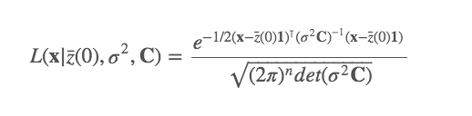
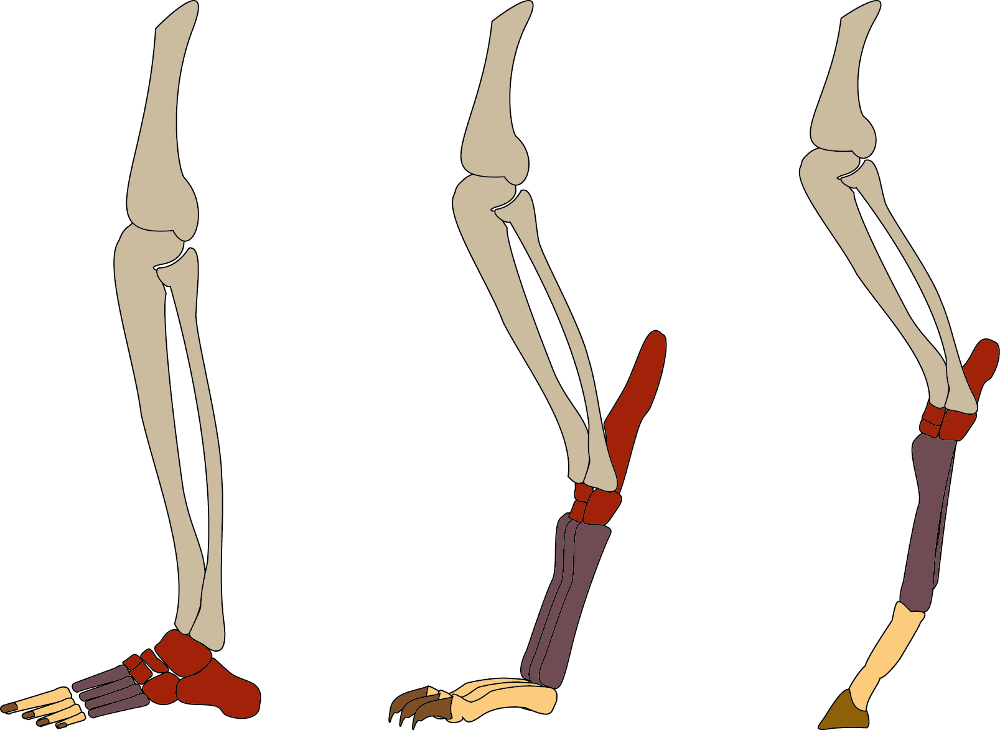

# Moving beyond the simplest model of evolution {#tempo-mode}

```{r, echo = FALSE, message = FALSE, warning = FALSE}
# Load libraries (hidden)
library(ggtree)
library(ape)
library(caper)
library(reshape2)
library(tidyverse)
library(patchwork)
library(ggimage)
library(knitr)
library(measurements)
library(cowplot)
library(phytools)
```

Like all statistical methods, comparative methods have their limitations. The focus in this chapter will be on explaining some of the problems inherent in the simplest comparative models, then looking at how we can move beyond these to consider more complex evolutionary outcomes. 

## What is wrong with the Brownian model?
Many of the methods described in the preceding chapters have in common that they estimate parameters from datasets under a specific model, namely the Brownian model. In this model the parameters estimated are the Brownian variance (σ2) and the mean value of the trait across the clade. In the case of the $\lambda$ model, the Brownian model is extended to include the $\lambda$ parameter that accounts for non-phylogenetic trait variation. However, it is important to realise that these methods will always return best fit values of the parameters, even if the model is a poor fit. The values of the parameters tell us nothing about whether the model provides a good description of the data and importantly, they don’t tell us whether the model is biologically plausible. For instance, a Brownian model imposes no upper or lower limits on the trait values, which is clearly unrealistic when modelling a trait such as body mass. Therefore, the Brownian model can be argued to be biologically implausible for such data. 

In this chapter we explore some of the considerations that you need to think about in judging whether your comparative analysis is fit for purpose. There are sometimes extra analyses you can do to check whether your model is defensible or publishable. But you should always think about whether you are using a biologically realistic model and whether alternative methods might be more suitable. 
 
```{block, type = "warning"}
This is a key point to remember the "Jurassic Park caveat"; just because we *can* fit all of these models to our data doesn't mean that we *should*. Before applying any of the models we discuss below, think very carefully. What questions are you trying to answer? What would a result one way or the other tell you about evolution in your study group? It is often tempting to just fit all of these models, then tell a "just so" story about why one model fits best. But without a clear question and a prediction about what you might find, at best the results might not tell you anything interesting about evolution in your group, and at worst the results may be nonsensical. This is especially true when sample sizes are low, and/or we expect there is error in our data or our phylogeny. Pay close attention to the caveats discussed below.
```

## Brownian motion recap

Until now the model of evolution we've been using is the Brownian motion model of evolution. If you haven't already read the section on Brownian motion in Chapter \@ref(foundations2), now would be a good time to do so. But if you already feel fairly comfortable, let's just remind ourselves of the summary we produced in that chapter.

The key features of the Brownian motion model are:

- Traits evolve at random, i.e. by a random walk.
- The direction and magnitude of the trait change at one time interval is independent of the direction and magnitude of the trait changes at other time intervals.
- There is no overall drift in the direction of evolution.
- Traits evolve at a rate $\sigma^2$.
- The rate of evolution is constant.
- Variance in traits increase (linearly) in proportion to time.
- The overall variance of the Brownian process is the rate of evolution times the amount of time that has elapsed. 

In terms of the model parameters:

- The model can be fully described using just two parameters $z(0)$ and $\sigma^2$.
- $z(0)$ is the starting value of the trait we are interested in. This is the mean value for the trait seen in the ancestral population before there have been any changes to the trait.
-  $\sigma^2$ is the rate at which evolution (i.e. trait change) occurs. It is also referred to as the Brownian rate parameter.

Some biological implications of the model are:

- Correlation among trait values is proportional to the extent of shared ancestry for pairs of species, i.e. close relatives are more similar than more distant relatives. 
- Different lineages evolve at the same rate.

```{block, type = "detail"}
### How do we fit Brownian motion models, and the other models discussed in this chapter?

Most of the models we talk about in this book are fitted using Maximum Likelihood. But what exactly does that mean? Likelihood can be thought of as the probability of your model, and is generally expressed as an equation. As a silly example, the likelihood of my desire to eat cake is a function of how long it has been since I ate some cake ($t_{cake}$) and how delicious the cake looks ($D$). So the likelihood could be expressed as $desire = t_{cake} + D$. The Maximum Likelihood will be when the cake looks really delicious and it's been ages since I last had some cake. Each different model will have its own likelihood function or equation. These are often quite complicated. 

To get the Maximum Likelihood for a model, we need to find the values of the parameters that maximise the likelihood function. A simple way to do this would be to pick every possible combination of parameter values, and then to calculate what the likelihood would be for each combination. You can then easily pick the best value. However, this is quite inefficient and time consuming! Instead we tend to use some kind of *optimisation* procedure to get the best value without having to try every possible combination. 

Optimisations are often described in terms of hills and valleys. If you're in the mountains looking for the highest peak, you could wander around the whole area, recording the height at each point, and then at the end of the survey pick the highest point (this is often called an exhaustive search, and would definitely be exhausting using this mountain analogy). Instead, we can make the process faster by always walking towards higher ground. If we did this we'd spend less time in the valleys and more time climbing towards the highest peaks. This is optimisation. Most optimisation procedures also allow for the fact that this might leave you stranded on *a* high peak, but not *the highest* peak, so allow for magically jumping between peaks from time to time. When we fit models the computer does all of this hard work for us. 
```

One thing we didn't explore in that chapter was the likelihood function for Brownian motion. It's not completely necessary for understanding the model, but we should consider it for completeness.

We know that under a Brownian motion model, the data at the tips and nodes are drawn from a multivariate normal distribution with a variance-covariance matrix, $C$, that is calculated using the phylogeny (see Chapter \@ref(foundations2)). Therefore, we can calculate the likelihood of our data given the Brownian model (remember likelihood is proportional to the probability of observing the data given the model, *P(data|model)*) using a standard formula for the likelihood of drawing numbers from a multivariate normal distribution.



This looks horribly complicated, which is why we avoided it in Chapter \@ref(foundations2), but the important thing is to notice that when we fit these models, all the computer is doing is plugging the values of our model parameters, $z(0)$ and $\sigma^2$, and the variance covariance matrix generated from the phylogeny (C), and the tip values (x) into the equation and extracting the likelihood. This is then optimised to get the Maximum Likelihood. The parameter values used to get the Maximum Likelihood are the ones the reported to us by the computer. For more details see @harmonbook.

### Why might the Brownian motion be a poor model of trait evolution?

In Chapter \@ref(foundations2) we asked you to think about why Brownian motion might not be a very realistic model of trait evolution. Hopefully you came up with some of your own ideas and examples, but some major issues are as follows.

1. Close relatives should be more similar than more distant relatives. This may not always be the case. For example, when *convergent evolution* occurs among distant relatives adapting to the same *selection pressures* (e.g. bats and birds both have wings but aren't close relatives), or when species are rapidly evolving to fill different niches in an adaptive radiation (e.g. Darwin's finches are closely related but have very different beaks). 

2. All species and all lineages evolve at the same rate ($\sigma^2$). Lots of evolutionary theories are based on certain groups evolving quickly in response to novel selection pressures, or to the availability of new niches. We also often discuss how particular traits, so called *key innovations*, like flight might allow increased rates of evolution for species with that trait. So a single rate of evolution across the whole phylogeny is probably a major oversimplification. 

3. Traits evolve at random, and with no trend in direction. This should mean that all values of a trait are possible, but we generally don't see this in nature. 

In the next few sections of this chapter we will discuss some ways we can deal with some of these problems.

## Alternative models
There are many alternative models of trait evolution in the literature as well as a plethora of alternative methods for analysing comparative data. We don’t have space to review all of them, so here we provide an overview of three of the models proposed in the literature that typify the way that we can address the limitations of the simplest Brownian models. We focus on three aspects in particular: varying the rate of trait evolution, adaptive constraints, and ecological interactions. 

### Varying rates of evolution

As noted above, one major limitation of Brownian motion is that all lineages must have the same rate of evolution ($\sigma^2$). But we have pretty good biological reasons for thinking this is not true! 

Let's imagine we are working on a group of insects where most species are carnivorous, but one highly morphologically diverse group is herbivorous. We might suspect that the rate of evolution of the herbivorous species is higher than than of the carnivorous species. The Case Study below provides an empirical example of this looking at rates of body size evolution in mammals [@kubo2019].

Several methods exist that modify the Brownian motion model so that different rates (i.e. different values of $\sigma^2$) are possible for different lineages. There are several ways of doing this, so we will just focus on the simplest below [@o2006testing; @thomas2006comparative]. To investigate this we can estimate the Brownian rate parameter $\sigma^2$ for just the herbivorous species, and for just the carnivorous species. This uses a simple modification of the likelihood function for Brownian motion, but rather than having one value for the variance covariance matrix ($C$) we instead construct separate variance covariance matrices for each group ($C_1$ and $C_2$), and each has a different $\sigma^2$ ($\sigma^2_1$ and $\sigma^2_2$; @o2006testing). Therefore when the likelihood is estimated $\sigma^2_1$ and $\sigma^2_2$ are optimised [@o2006testing]. A similar method was proposed by @thomas2006comparative, but this allows both $\sigma^2$ and $z(0)$ to vary among groups. In both cases, the full method involves also fitting a standard Brownian motion model where there is only one $\sigma^2$ (and $z(0)$), and then comparing the AIC (see below) values for the model with and without the rate variation [@o2006testing; @thomas2006comparative].

The one slightly tricky thing for both of these methods is deciding what to do with the branch where we think the change in rate occurred. Should it be included in the group we think has a rate of evolution of $\sigma^2_1$ or the group that we think has a rate of evolution of $\sigma^2_2$? Or neither? @o2006testing suggest two approaches: (i) the "noncensored" approach which assigns the branch to one of the rate parameters; and (ii) the "censored" approach, where the branch is omitted from the calculations. Note that the method of @thomas2006comparative is equivalent to the censored approach.

```{block, type = "examps"}
### Case study: Do rates of body size evolution in mammals with different foot postures?



Terrestrial mammals have evolved a variety of foot postures. Plantigrades like humans and rodents walk flat-footed, digitigrades like cats and dogs walk on their toes, while unguligrades like horses and antelope walk on their hooves or tiptoes. Foot posture has implications for species ecology and body size; unguligrade mammals tend to be large, while smaller mammals tend to be digitigrade or plantigrade. @kubo2019 tested whether these different foot postures influenced the rate of body size evolution.

To investigate this question @kubo2019 collected data on the body sizes and foot posture of 880 species of mammals. Then they estimated the transition rates between the three states (plantigrade, digitigrade, unguligrade) using a continuous time Markov model, similar to the ARD model we met in Chapter 3. Next they tested whether rates of body size evolution varied across mammals with these different foot postures, and at transitions among different postures.

@kubo2019 found that transitions among postures were mostly between plantigrade and digitigrade, and between digitigrade and unguligrade. At these transitions between postures, rates of body size evolution were significantly higher leading to the larger body masses of digitigrade species (∼1 kg) and unguligrade species (∼78 kg) compared with their plantigrade and digitigrade ancestors. While it’s not possible to tell whether the elevated rates of body mass evolution are due to changes in foot posture, or vice versa, this does nicely highlight that rates of evolution regularly vary within and among groups. The simplest Brownian motion models cannot capture this complexity.
```

## The Ornstein-Uhlenbeck (OU) model

Another limitation of Brownian motion noted above is that traits evolve at random, i.e. by a random walk, and there is no overall drift in the direction of evolution. One solution to this problem is to use another model of evolution, the *Ornstein-Uhlenbeck or OU model* (@hansen1997stabilizing, @butler2004phylogenetic).

The OU model is a random walk in which trait values revert back towards some ‘optimal’ value, $\mu$ (also called $\theta$ in some papers), with an attraction strength proportional to the parameter $\alpha$. 

```{block, type = "warning"}
You'll often see $\mu$ referred to as the *long-term mean* rather than the optimal value, and we'll use this terminology here because it's more accurate. Calling $\mu$ the optimal (or best) value for a trait is misleading, because we don't actually know what the optimum would look like, and it is likely to be influenced by far more factors than we are able to investigate in these simple models. Be very wary of any paper that claims to have identified trait optima from OU models.
```

The OU model has four parameters. The first two are the same as those found in the Brownian motion model, $z(0)$, the starting value of the trait we are interested in, and $\sigma^2$, the rate of evolution. The OU model has two additional parameters: $\alpha$ and $\mu$ (sometimes called $\theta$). The parameter $\mu$ is a long-term mean, and it is assumed that species trait values evolve around this value. $\alpha$ is the strength of evolutionary force that returns traits back towards the long-term mean if they evolve away from it. $\alpha$ is sometimes referred to as the “rubber band” parameter because of the way it pulls traits back towards $\mu$.

```{block, type = "detail"}
Not all implementations of the OU model actually estimate $\mu$. In some implementations (see *online materials*) $\mu$ is equivalent to $z(0)$, the starting value of the trait. 
```

To help with understanding how the Brownian motion and OU models are linked let's look at the equations for trait change under each model.

In the Brownian motion model, trait $X$ evolves at a rate $\sigma$ as follows:

$dX(t) = \sigma dW(t)$

We can read this equation as the change ($d$ or $\delta$ or $\Delta$ often represent change in equations) in trait $X$ over time $t$ is equal to a random value drawn from a normal distribution with mean 0 and variance $\sigma^2 * t$ (we use $W$ because this can also be called a white noise function). In *Chapter 3* we investigated how changing $\sigma^2$ affects the change in $X$, with low values leading to small changes in $X$ and high values leading to big changes in $X$. The variance of $X$ at the tips will be equal to $\sigma^2 * time elapsed$.

The equation for how traits change according to the OU model is:

$dX(t) = -\alpha(X(t) - \mu) + \sigma dW(t)$

Notice anything familiar? The second term after the $+$ is exactly the same as the equation for Brownian motion, i.e. $\sigma dW(t)$! So the OU model can be thought of as a modification of the Brownian model (or more accurately, the Brownian model is a special case of the OU model). In fact, if $\alpha$ is zero then the first half of the equation is cancelled out, meaning that when $\alpha$ is zero the OU model and the Brownian model are identical.

What about when $\alpha$ is not zero? The $-\alpha(X(t) - \mu)$ part of the equation then becomes important. This reflects the change toward the long-term mean, $\mu$. If the value of $X$ is close to the long-term mean, then $X(t) - \mu$ will be small (it can be positive or negative depending on whether $X$ is bigger or smaller than $\mu$). If the value of $X$ is a long way from the long-term mean, then $X(t) - \mu$ will be large. This means that changes in $X$ in an OU model will be bigger when $X$ is further from the long-term mean. The value of $\alpha$ modifies this so that when $\alpha$ is large there is a greater "pull" towards $\mu$. When $\alpha$ is small, the pull towards $\mu$ is much weaker and the model will look a lot like Brownian motion.

Let's have a look at some simulated data to see what this looks like. We'll imagine we have a dataset of 50 species of crab. We can simulate claw length data for each species using Brownian motion and OU. Figure \@ref(fig:crab1) shows how the outputs of these simulations differ. In both simulations, $z(0) = 20 mm$ and $sigma^2 = 0.1$, but in the OU model we also specify the long-term mean $\mu = 20 mm$, and the "rubber band" parameter $\alpha = 0.1$. Notice that while the values for claw size are spreading out in the Brownian simulation, in the OU simulation these values are all fairly close to $\mu = 20 mm$ because they are being drawn back towards $\mu$. This looks a lot like something approaching an equilibrium, and indeed the OU model is an equilibrium model.

```{r crab1, echo = FALSE, fig.cap="Simulations showing how the claw size of crabs changes through time under a Brownian model with z(0) = 20 mm and sigma2 = 0.1 (black lines) and an OU model with z(0) = 20 mm, sigma2 = 0.1, mu = 20 mm and alpha = 0.1 (red lines)", out.width='80%', fig.asp=".75", fig.align='center'}

# Simulate tree
crabs <- rcoal(50, br = 5)

# Create Brownian and OU simulation data
bmdata <- fastBM(crabs, sig2 = 0.1, a = 20, internal = TRUE)
oudata1 <- fastBM(crabs, sig2 = 0.1, a = 20, internal = TRUE,
                 theta = 20,  alpha = 0.1)

phenogram(crabs, bmdata, ylab = "claw size (mm)", 
          ftype = "off", ylim = c(10, 35), lwd = 0.5)
phenogram(crabs, oudata1, ylab = "claw size (mm)", 
                 ftype = "off", lwd = 0.5,
                 add = TRUE, col = "red1")
```

We can also investigate what happens as we increase $\alpha$, as shown in \@ref(fig:crab2). As $\alpha$ gets bigger the trait is more closely evolving around $\mu$. You might remember that the variance of trait values at the tips of the tree for Brownian motion is expected to be $sigma^2$ multiplied by the time elapsed. For OU models the variance is $sigma^2$ *divided* by $2\alpha$, so the variance at the tips will get smaller as the pull towards the long-term mean increases. When $\alpha$ gets really large, all imprint of history is lost and the trait evolution is essentially a rapid burst at the present (for more information on what we mean by "large" and "small" $\alpha$ values see the next section).

We can also change the value of $\mu$ so it is not the same as $z(0)$, as shown in \@ref(fig:crab2). You can see that the trait very rapidly evolves from the starting value and towards the long-term mean.
          
```{r crab2, echo = FALSE, fig.cap='Simulations showing how the claw size of crabs changes #through time under a) an OU model with z(0) = 20 mm, sigma2 = 0.1, mu = 20 mm and alpha = 0.1; b) an OU model with z(0) = 20 mm, sigma2 = 0.1$, mu = 20 mm and alpha = 0.5; and c) an OU model with z(0) = 20 mm, sigma2 = 0.25$, mu = 30 mm and alpha = 0.1', out.width='80%', fig.asp=.75, fig.align='center'}

# Create OU simulation data
oudata1 <- fastBM(crabs, sig2 = 0.1, a = 20, internal = TRUE,
                 theta = 20,  alpha = 0.1)
oudata2 <- fastBM(crabs, sig2 = 0.1, a = 20, internal = TRUE,
                 theta = 20,  alpha = 0.5)
oudata3 <- fastBM(crabs, sig2 = 0.1, a = 20, internal = TRUE,
                 theta = 25,  alpha = 0.1)

par(mfrow = c(1,3))
#par(mar = c(3,4,1,0))
phenogram(crabs, oudata1, ylab = "claw size (mm)", 
                 ftype = "off", ylim = c(15, 30), lwd = 0.5)
phenogram(crabs, oudata2, ylab = "claw size (mm)", 
                 ftype = "off", ylim = c(15, 30), lwd = 0.5)
phenogram(crabs, oudata3, ylab = "claw size (mm)", 
                 ftype = "off", ylim = c(15, 30), lwd = 0.5)
```

### How stretchy is your "rubber band" parameter?

A thorny issue with OU models is interpreting the $\alpha$ value. $\alpha$ can range from 0 to infinity (although most implementations set an upper bound) which makes it hard to interpret unless $\alpha$ is zero. Above you'll notice we refer to "small" and "large" values, without giving any cut-offs. One reason for this is that values of $\alpha$ vary with tree height, i.e. the maximum distance from the root of the tree to the tips. All else being equal, taller trees have lower $\alpha$ values than smaller trees, because in a taller tree there is more time for traits to return to the long-term mean value so $\alpha$ doesn't need to pull the traits back toward the long-term mean as strongly. So if we are interpreting whether $\alpha$ is small or large, we need to do this relative to the height of the tree. The simplest solution, especially if you are comparing across different trees, is to scale tree heights so they are equal to 1 [@ives2010phylogenetic]. 

Determining what we mean by small and large is still somewhat arbitrary, but there are two suggestions in the literature.

1. Rescaled $log(\alpha)$. Rather than using raw $\alpha$ values, we interpret $log(\alpha)$ after rescaling trees to a height of 1. In this case, $–log(\alpha) = 4$ represents a very low, almost Brownian, value and $–log(\alpha) = −4$ represents a very high value [@ives2010phylogenetic]. 

2. Phylogenetic half‐life. The *phylogenetic half‐life* ($t_{\frac{1}{2}}$) of a trait is the time it takes for a species to evolve halfway toward its new expected long-term mean [@hansen1997stabilizing]. We can estimate this as:

$t_{\frac{1}{2}} = \frac{ln(2)}{\alpha}$

If $t_{\frac{1}{2}}$ is short relative to the branch lengths of the phylogeny, evolution towards the long-term mean is fast and there is little influence of the past on trait values [@hansen1997stabilizing]. Conversely, if $t_{\frac{1}{2}}$ is extremely large relative to tree height, it suggests that if an OU process is acting, it is extremely weak and should not be interpreted as evidence of any kind of process.  $t_{\frac{1}{2}}$ equal to the height of the phylogeny is a moderate value suggesting some pull towards the long-term mean [@hansen2012interpreting]. 

This sounds a bit confusing, but hopefully it is clearer if we think about this in terms of our crab example above. This crab clade has been around for about 250 million years. If the phylogenetic half-life is 5 million years, i.e very short compared to the 250 million years the crab clade has been around, then claw size would very rapidly evolve to the long-term mean value, and just fluctuate around that for millions of years. All crabs in the clade would have a very similar claw size at the tips of the tree, but we wouldn't expect closely related crabs to be that much more similar to one another than more distantly related crabs, because their claw sizes will all be somewhere close to the long-term mean value. This is what we mean when we say there is little or no influence, or imprint, of the past when $t_{\frac{1}{2}}$ very low or when $\alpha$ is very high.

At the other end of the scale, if the phylogenetic half-life is 500 million years, i.e very long compared to the 250 million years the crab clade has been around, then claw size *might* be very slowly evolving towards the long-term mean, but it won't get there in the 250 million years the crab clade has existed. So although we might find that an OU model fits the data pretty well, we shouldn't over-interpret this as evolution towards an optimum value of claw size, because plenty of other things could be going on.

As a further note of caution, it is important to recognize that biases in the estimation of $\alpha$ lead to similar biases in $t_{\frac{1}{2}}$. We discuss these biases in more detail below [@cooper2016].

### Single stationary peak (SSP) versus more complex OU models

For the most part, when people talk about OU models in evolutionary biology they are talking about *single stationary peak* (SSP) models, where there is a single long-term mean or $\mu$. However, there are sensible biological reasons to expect that, at least in larger phylogenies, it is unlikely that there is a single "optimum" trait value. Instead, we might expect that groups in different *selective regimes* are evolving towards different long-term mean values. For example, if our crabs belong to two different selective regimes based on diet, we might expect different patterns of claw evolution in herbivores versus carnivores. Models where we fit different values of $\mu$ to different groups are often referred to as *multi-peak* OU models.

In addition, although OU models improve upon Brownian models by having traits evolve in more realistic directions, they suffer from the same problem that the rate of evolution, $\sigma^2$, is constant across the tree. We can improve on this by fitting more generalised OU models. Rather than going into too much detail here, we will just list the kinds of more complex OU models we can fit. We recommend reading more about these models if you need to use them [e.g. see @beaulieu2012modeling].

1. **OU models with different long-term means ($\mu$) for each selective regime, BUT the same rate of evolution ($\sigma^2$) and pull towards the mean ($\alpha$)**. In our crab example, we would fit a multi-peak OU model where we assumed that claw size was evolving towards one long-term mean ($\mu_{herbivore}$) in herbivorous species, and towards another long-term mean ($\mu_{carnivore}$) in carnivorous species, and $\sigma^2$ and $\alpha$ are constant.

2. **OU models with different long-term means ($\mu$) AND different rates of evolution ($\sigma^2$) for each selective regime, BUT the same pull towards the mean ($\alpha$)**. In our crab example, we would fit a multi-peak OU model where we assumed that claw size was evolving towards one long-term mean ($\mu_{herbivore}$) at one rate ($\sigma^2_{herbivore}$) in herbivorous species, and towards another long-term mean ($\mu_{carnivore}$) at a different rate ($\sigma^2_{carnivore}$) in carnivorous species, and $\alpha$ is constant.

3. **OU models with different long-term means ($\mu$) AND different pull towards the mean ($\alpha$) for each selective regime, BUT the same rates of evolution ($\sigma^2$)**. In our crab example, we would fit a multi-peak OU model where we assumed that claw size was evolving towards one long-term mean ($\mu_{herbivore}$) with one pull toward the mean ($\alpha_{herbivore}$) in herbivorous species, and towards another long-term mean ($\mu_{carnivore}$) with a different pull toward the mean ($\alpha_{carnivore}$) in carnivorous species, and $\sigma^2$ is constant.

4. **OU models with different long-term means ($\mu$) AND different rates of evolution ($\sigma^2$) AND different pull towards the mean ($\alpha$) for each selective regime**. In our crab example, we would fit a multi-peak OU model where we assumed that claw size was evolving towards one long-term mean ($\mu_{herbivore}$) at one rate ($\sigma^2_{herbivore}$) with one pull toward the mean ($\alpha_{herbivore}$) in herbivorous species, and towards another long-term mean ($\mu_{carnivore}$) at a different rate ($\sigma^2_{carnivore}$) with a different pull toward the mean ($\alpha_{carnivore}$) in carnivorous species.

```{block, type = "warning"}
It is likely that the complexity of some of these models is greater than the information contained within your data, unless your dataset is extremely large. 

Even a modest number of selective regimes will increase the number of parameters you are fitting considerably, for example a single stationary peak model has four parameters ($z(0)$, $\sigma^2$, $\mu$ and $\alpha$); while the most complex models we could fit would have an additional $\sigma^2$, $\mu$ and $\alpha$ for each group. 

Additionally, simulations of single stationary peak OU models indicate that trees with more than 200 tips are necessary to obtain acceptable *false positive rates*, i.e. to make sure you don't detect OU when you shouldn't [@cooper2016], meaning that an additional 200 tips might be needed for acceptable error rates in a multi-peak model with two groups (but constant $\sigma^2$ and $\alpha$). These numbers increase the more parameters you try to fit.

Finally (and most importantly) it's important to stop and think carefully before interpreting these complex models. Do they make sense in terms of what we know about the biology of our group? When fitting these models, **always check parameter estimates** from your models to ensure that they make biological sense (see *online materials*). If you don't check, you might unknowingly pick a poor model with incorrect biological interpretations. The more complex your models the more likely this is.
```

### Here be dragons...things to be aware of when fitting OU models

The OU model is an attractive model of evolution for a number of reasons. People assume it better represents the evolutionary process, because evolution towards some sort of optimal trait value is what we might expect under natural selection. It's also pretty easy to fit using various implementations in R (see *online materials*) and other programs. These has led to the OU model being used a lot in recent years.

The model, however, has some limitations that you should consider before using it in your own work. You should also think *very carefully* about the biological interpretation of the model.

We return to this later in this chapter, but often when people investigate models of evolution they fit multiple models and compare them, and then select the "best" model (see below). It is standard to compare models to Brownian motion, because it acts as a reasonable null model. Often in these scenarios, OU is favoured over the Brownian model [e.g. @harmon2010early]. When we do this, however, the OU model may actually be favoured for non-biological reasons. The two most important issues are: 

1. *False positive (Type I) error rates* are high when sample size is low, i.e. when you have a small dataset, the likelihood of recovering an OU model when actually it's not a very good fit is pretty high. Simulations of single stationary peak OU models indicate that trees with $> 200$ tips are necessary to obtain acceptable false positive (Type I) error rates [@cooper2016], and this is likely exacerbated when fitting multi-peak models. We are, however, unwilling to recommend a minimum tree size because the performance of the OU model may vary among datasets for reasons other than tree size including measurement error...

2. *Measurement error* increases false positive (Type I) error rates, i.e. when you have errors in your data, the likelihood of incorrectly recovering an OU model increases. This is likely because measurement error creates noise in the data that is more effectively modelled by the extra parameters in the OU model than by the Brownian model alone. Note that the effects of measurement error become more severe with increasing tree size, hence our hesitance to recommend a minimum tree size for fitting OU models. 

What can we do to solve these problems? The first thing to do is look at estimates of $\alpha$, not just at which model is "best" (see above for more information on interpreting values of $\alpha$). For example, if OU is favoured over Brownian motion but $\alpha$ is close to zero (or $t_{\frac{1}{2}}$ is very high), it is likely that measurement error, intraspecific variation or phylogenetic uncertainty are generating noise that is more effectively modelled by the extra parameters in the OU model than by the Brownian model. Thus, this does not reflect any kind of OU process underlying the data. Likewise, when $\alpha$ is very large (or $t_{\frac{1}{2}}$ is very small) we lose the imprint of the past on trait values and the pattern can be close to random, which also doesn't reflect an underlying OU process. 

Second, we can use simulations to assess the model fit. We can simulate data under Brownian motion and the OU model to generate distributions of parameters under known values. These can then be compared with results for your dataset (see @slater2014robust, @slater2014correction; for a related approach). This is important because we have shown that the shape of a phylogeny has consequences for parameter biases and hypothesis tests. Any given tree will therefore generate unique parameter estimates. Generating data under the favoured OU model will allow an assessment of whether it is possible to retrieve known values, or whether there is evidence of bias.

Third, if possible, include additional data. If data on fossils are available then these could be added to the analysis (@slater2012integrating, @slater2014correction). Indeed, if fossil taxa can be reliably placed in the phylogeny then they may actually improve model accuracy. If there is a lot of uncertainty in fossil placement, however, then they should be treated cautiously. 

```{block, type = "warning"}
The problems that we discuss here are not limited to OU models. Any model of trait evolution that attempts to account for non‐Brownian components of trait variation is susceptible to being misled by measurement error, and in some scenarios measurement error can also incorrectly favour Brownian motion over the true model. The fundamental problem is that **rejection of the Brownian model in favour of another model does not necessarily say anything about evolutionary process**. This problem can be helped a little if model comparisons are set in a solid hypothesis‐testing framework where alternative hypotheses make clear predictions about the resulting patterns that can be unambiguously associated with particular models. We should not use any statistical model without thinking carefully about the limits of the data we are using and the biological interpretation of the model and its outputs.
```

```{block, type = "examps"}
### A cautionary note on two cautionary notes
In 2016 we published a paper called “A cautionary note on the use of Ornstein-Uhlenbeck models in macroevolutionary studies” (Cooper et al 2016). This paper contains many of the same points made in this chapter about fitting and interpreting OU models. It was a reaction to the many studies at that time fitting BM and (single stationary peak) OU models, finding the OU model fitted better than BM, and interpreting this as evidence of stabilising selection, despite low α values or otherwise poor model fit. An unintended consequence of this paper was that some people assumed this meant all OU models were flawed and should not be used. Since 2014, when we wrote the paper, many new methods using the OU model have been developed, and we use many of these in our own research. We stand by the caveats stated in that paper, and believe we should always be aware of the caveats of any statistical method, but we are not now, nor were we then, saying that OU models should never be used. This confusion led to the paper “A cautionary note on “A cautionary note on the use of Ornstein-Uhlenbeck models in macroevolutionary studies”” (Grabowski et al 2023) being published in 2023. This paper describes the ways the authors disagree with our 2016 paper. We recommend that you read both papers and enjoy the debate!
```

## Niche-filling models

In the previous two sections, we have looked at how the rate of evolution might vary through time because of different evolutionary mechanisms using two models. One of the issues that remains with both models is that they assume that there are no ecological processes operating, so that all species evolve completely independently of each other. In principle the models will allow two species to have exactly the same trait values. If the traits relate to ecological niches then we know that this could lead to ecological competition. For instance, it is known that in birds, beak size is related to the size of seeds they feed on. If two species have the same beak size then they would potentially be in competition with each other for the same seeds. Indeed, long term studies on Darwin’s finches have shown that this can happen, and competition of this sort can lead to evolutionary changes just a few years [@grant2008].  

@price1997 introduced a model for comparative data that incorporated ecological trait evolution. The scenario envisaged is an adaptive radiation. This is where a group of species evolves from an ancestor that invades an ecologically empty habitat. The example mentioned above, Darwin’s finches, is a classic: about a million years ago, an ancestral species (actually, a tanager not a finch!) arrived on the Galapagos archipelago. Presumably there were no other bird species present and consequently, there was a suite of empty niches available. The niches were defined by the food resources, which included seeds, insects, and cactus flowers. Each resource requires specific adaptations in terms of beak morphology. For example, a fine long beak is required to eat small insects. Alternatively, a thicker wider beak is needed to crack open and eat seeds. Larger beaks are needed to eat large seeds, smaller ones are adapted for feeding on small seeds. As we now know, the ancestral species radiated into a group of 18 species (the subfamily Geospizinae) that now occupy all of these niches, and beak size and shape is closely related to the ecology of each species. Another example using Phylloscopus warblers is described in Case Study 6.2.

Inspired by this kind of example, the model is an explicitly ecological one in which it is assumed that species’ traits map onto the ecological niche that they occupy. In the simplest version of the model, it is assumed that there is initially just one species in a single niche. New niches arise sequentially: developing the hypothetical example above, for example imagine that there is an empty island and new plant species arrive at random, each producing seeds of a specific size. A bird species arrives on the island and feeds on the first plant species (species 1 in Figure \@ref()). Then, as new plants arrive there will be selection on the birds to feed on these new plants. This selection will require adaptations in terms of beak morphology, and the species will evolve to fill the new niche. This creates a new species that is ecologically distinct from the parent (e.g. species 2 in Figure \@ref()). As new niches arise this process iterates.

Figure 6.3 shows the creation of the first four species in a radiation according to this model, together with the outcome following the assembly of a radiation of 12 species. The key features of this niche-filling motion model are:
Traits evolution is driven by the distribution of ecological niches. 
The direction and magnitude of the trait change at one time interval is dependent on the distance between the current trait combination and the nearest niche. 
The rate of trait evolution depends on the number of occupied niches.
The rate of trait evolution declines through time.
The correlation between traits is not the same as correlation between trait changes.


The parameters of the model are:


The trait space defined by the niches (e.g. in the case of two traits, a bivariate normal distribution of traits with parameters describing the mean and variance of the traits and the correlation between them).
The maximum number of niches.
The rate at which new niches arise.


Case study 6.2 Ecological mechanisms underpinning the adaptive radiation of Phylloscopus warblers
An adaptive radiation is essentially defined as a group of species that have originated from a common ancestor, with associated ecological diversification into a range of ecological niches (Losos 2003, 2010). Phyllscopus warblers are a genus of small insectivorous passerines that breed across Europe and Asia. It is not unusual for several species to occur sympatrically (i.e. live in the same place), therefore it has been hypothesised that ecological differences underpin the radiation. Price and colleagues have studied the radiation of this and other similar species in several landmark studies (e.g. Richman & Price 1992; Price et al. 2014).  


<Figure CS6.2A near here>

Figure CS6.2A Ecology and the adaptive radiation of Phylloscopus warblers. (a) The phylogeny of the group. (b) The niche space of the radiation, measured by prey size and beak size of each species. The numbers correspond to the nodes in (a). (c) A dataset generated randomly according to the niche-filling model described above. 


The inter-relationships of the group are shown in Figure CS6.2Aa, while Figure CS6.2Ab shows the niche space. A visual inspection of the niche space suggests that the biggest divergences in niche space occurred towards the base of the phylogeny and that subsequent changes were smaller, exactly the pattern predicted by the niche-filling model. Figure CS6.2Ab shows a dataset of eight species generated by the niche filling model that is superficially very similar. 


Of course, a visual inspection is not an objective test of the model! A problem with the nice-filling model is that it is difficult to fit to data using the statistical methods that we can use for the Brownian model and that we describe later in the Primer. However, it is possible to show that the data in Figure CS6.2A are non-Brownian in a manner consistent with the niche-filling model. Using simulations under a Brownian model, it is found that the data behave differently and this model can be rejected. More recently, advanced statistical techniques have been developed to permit this type of model to be applied to data. For example, Clarke et al. (2017) developed a simulation-based method using “Approximate Bayesian Computation”. Although such methods offer exciting possibilities for exploring more complicated models, these are statistically difficult and beyond the scope of an introductory Primer!


Figure CS6.3.2 These histograms show the results of a simulation analysis of the data in the above figure. Data were simulated according to a Brownian process and the key parameters estimated from the simulated data. What is readily apparent is that the data from the simulation are not representative of the real data (in each case the * notes that the result is statistically significant). 


This model is clearly very different from the Brownian model and its assumptions differ in almost every respect. Also, this model is formulated very differently: it is not a mathematical model in the same way. Indeed, it is not possible to write down an equation for the model as is the case for the Brownian. The niche-filling model is a simulation which proceeds through the successive application of the rules that define it. 
You might dispute the ecological or evolutionary reality of some aspects of the formulation of the model, and this model is clearly designed for a specific scenario. However, the value of this model is to show that one of the key assumptions of the model (i.e. traits evolve independently) can fundamentally alter the outcome of the model. In the niche-filling model, the rate and direction of evolution depends on the traits of the species present, and how many species are already in the radiation. 
One of the most important model outcomes concerns the correlations between traits. A key job for the Brownian model is to enable us to model the variation in pairs of traits and to measure the strength of the relationship between them, and this is probably the most common task for this model (see <start CR>Chapter 5<end CR>). A key feature of the Brownian model is that the correlation between traits is the same as the correlation between the evolutionary changes in traits. This is not true of the niche-filling model, and this is very evident in Figure 6.1. In this example, the traits are closely correlated as defined by the niche space ellipse. However, the changes in traits very clearly don’t follow this ellipse (e.g. Price 1997; Harvey & Rambaut 2000). If you try to measure the correlation between the traits using the Brownian model, then this will fail. 

## The Brownian model is dead… long live the Brownian model!
Given all that we have written in this chapter, you might be forgiven for wondering why we use the Brownian model at all. You might be even more surprised to discover that it is still the most used model in the comparative literature!
Despite the many limitations, the Brownian model has several compelling strengths. First, it is very closely related to the method of Generalised Least Squares (GLS), a powerful statistical framework (see Chapter 5). This framework has been developed and explored by statisticians over many years. GLS forms the basis of familiar (non-comparative) statistical methods used throughout science. Because the Brownian model is very closely related to these models, there is a great deal to be gained by using the Brownian model and the GLS implementation of the comparative methods if possible. Moreover, GLS methods have been developed to model spatially and temporally dependent data. This opens exciting possibilities to combine models for processes across temporal and spatial scales.  

Another advantage of the Brownian model is that it is potentially computationally very fast to fit using the pruning algorithm initially developed by Felsenstein. Consequently, it can be applied to large problems. This is important because over the past 20+ years, phylogenetic trees have become available for large groups, including thousands of species. Sometimes within-species sequences permit even more refined phylogenetic analyses, incorporating tens or even hundreds of thousands of taxa. Unfortunately, the time taken to fit a model and extract parameter estimates can grow exponentially with both the size of the dataset and the complexity of the model. To put this in context, we recently published a paper where each of the analyses took three or four months to run. While we might like to work with more complex models, some problems become too unwieldy and a simpler model is the only way forward.

Finally, it is worth noting that many other models are in effect Brownian models in disguise. For example, the OU model can be thought of as a transformed Brownian process in which the branch lengths have been exponentially transformed. Whilst some of the issues of the simplest incarnation of the Brownian model have been dealt with, in a sense the Brownian model lives on!

## Fitting and assessing models of evolution

Now we've introduced you to some of the different models of trait evolution that are available, we can think more about applying these to our own datasets. Generally, people apply several models to a dataset, so we need to think carefully about the following questions.

1. Do I have sensible biological reasons to fit these models? 

We warned you near the start of the chapter that it can be tempting to just fit all possible models to a dataset and see what comes out as the "best". But without a biological question to guide the choice of models, this can just produce a lot of noise and results that make little sense biologically. Carefully consider whether each model is appropriate before fitting it. Note that it is sensible to compare any model to the null model of Brownian motion, but merely rejecting the null model doesn't tell us much biologically, as we already know Brownian motion is a poor fit to the evolutionary process.

2. Which model(s) fit best?

When fitting multiple models we often want to know which is the "best" model, by which we mean which model best fits the data, i.e the tree and trait data. For models that use Maximum Likelihood we usually do this using some version of *Akaike Information Criterion (AIC)*, see section below for more details. Bayesian methods sometimes use the Deviance Information Criterion (DIC) which is analogous to AIC.

```{block, type = "info"}
Remember that all models are wrong, but some are useful! No model selection procedure can tell you what the "best" model is, all it can tell you is *which of the models you are comparing best fits the data* (i.e. the trait data and the tree). It is important to remember that model selection methods will still select a "best" model, even if all the models you are comparing are bad fits to the data. Be wary of this when interpreting your results.
```

3. Are my models adequate? 

In *Chapter 5* we talked about model adequacy. This is equally important for models of trait evolution. Simulating data under the Brownian model will generate null distributions [e.g. @boettiger2012your] and allow straightforward assessment of model fit, for example by generating appropriate critical values for Likelihood ratio tests. @boettiger2012your discuss this at length and other papers use similar approaches (e.g. @martins1991phylogenetic, @freckleton2002phylogenetic).

4. Are the parameters of my models biologically reasonable? 

Finally, it is really important to actually *look at the parameter values* of your model outputs. We highlighted this earlier in the chapter, but want to reiterate it now. An OU model with alpha of 0.1 is not much different from Brownian motion. Do the evolutionary rates make sense or are they nonsensical given the age of the clade? Given what we know about extinct members of the group, do starting trait values make sense? Do not blindly accept the outputs of your models.

```{block, type = "warning"}
Remember that your results are **only as good as your phylogeny and your data**. Phylogenies are hypotheses about the way evolution happened, and generally miss out lots of extinct species. Always consider this when interpreting the results of models of evolution, and indeed any phylogenetic comparative analysis.
```

### Model selection with AIC

We can use the Akaike Information Criterion (AIC) to select the best fitting model from a set of models (@burnham2002book; @o2006testing). We often refer to AIC as a *penalised likelihood*, because AIC tells us how good the fit of the model is given the number of parameters in the model. Why does the number of parameters matter? The more parameters in a model, the better the fit of the model will be (see discussion of over-fitting in *Chapter 3*). But we want to know if there is a clear improvement in model fit by adding parameters, rather than an incremental increase in fit which is expected. 

The equation for AIC is:

\begin{equation}
  AIC = -2(ln(likelihood)) + 2k
\end{equation}

Where $likelihood$ is the probability of the data given the model and $k$ is the number of free parameters in the model. The best model is the model which has a good fit to the truth with few parameters, i.e. the model with the *lowest AIC*. If we don't have many taxa in the model, i.e. sample size is small, we can use *AICc* instead of AIC. AICc increases the relative penalty for high numbers of parameters with small datasets by multiplying the AIC by $\frac{n}{n - k - 1}$ as shown below, where $n$ is the sample size.

\begin{equation}
  AICc = -2(ln(likelihood)) + 2k \frac{n}{n - k - 1}
\end{equation}

As $n$ gets bigger, $\frac{n}{n - k - 1}$ gets closer to 1, e.g. if $n = 2000$ and $k = 2$, $\frac{n}{n - k - 1} = 1.002$, so AIC and AICc are almost identical. Therefore, if you have any doubt about whether you have a small sample size or not, it's worth using AICc to be on the safe side. If your sample size is large enough AICc will be virtually identical to AIC anyway.

AIC and AICc scores can also be shown as *$\Delta$AIC scores*. These indicate the difference between the AIC/AICc of the best model, i.e the one with the smallest AIC, and the AIC/AICc of each model. This means that the best model has a $\Delta$AIC of zero. This doesn't change the results in any way, it just makes it easier to quickly identify the best model.

Finally, you may also see people using *Akaike weights* or AIC$_w$ to compare models. These represent the relative likelihood of a model. The AIC_w for a given model is the relative likelihood of the model $e^{-0.5 \Delta AIC_i}$, divided by the sum of relative likelihood values across all models, i.e.

\begin{equation}
AIC_w_i\frac{e^{-0.5 \Delta AIC_i}}{\Sigma(e^{-0.5 \Delta AIC})}
\end{equation}

The best model will have the *highest AIC$_w$*. The AIC$_w$ scores for all the models should add to one, so this can give you an idea of how much support there is for models other than the best model.  

Which should you report? It's a matter of personal preference, but it's usual to report AIC or AICc at the minimum, plus if comparing many models it can be useful to also report one of either $\Delta$AIC or AIC$_w$ as it is easier to quickly read these in a table.

```{block, type = "info"}
Remember: For AIC or AICc the best model is the one with the *lowest value of AIC*. For $\Delta$AIC the best model is the one with one with *$\Delta$AIC of zero*. For Akaike weights the best model is the one with the *highest AIC_w*, i.e. closest to one. 
```

## Chapter summary
- The Brownian motion model of evolution has several limitations. In nature, it is unlikely that traits evolve at random or that rates of evolution are constant across the phylogeny. Several alternatives to the Brownian motion model have been proposed.
- One solution to the limitations of the Brownian motion model is to modify the model so that different rates (i.e. different values of σ2) are possible for different lineages.
- Another solution is to use a different model of evolution, such as the Ornstein-Uhlenbeck (OU) model, or an ecologically informed model like the niche-filling model.
- The key features of the OU motion model are (i) traits evolve at random, i.e. by a random walk; (ii) the direction and magnitude of the trait change at one time interval is independent of the direction and magnitude of the trait changes at other time intervals, (iii) traits evolve at a rate σ2; (iv) the rate of evolution is constant. Note that these features are shared by the Bronian motion model. However, in the OU model (v) traits are pulled back towards the long term mean μ, with a force of strength α, if they evolve away from it.
- The basic OU model has one long term mean and is also known as the single stationary peak (SSP) model. OU models can be extremely complex, and can contain multiple peaks, which may have the same or different values of α and σ2.
- The niche-filling model is an explicitly ecological model in which it is assumed that species’ traits map onto the ecological niche that they occupy.
- Despite its limitations, the Brownian model is still the most used model in comparative analyses, due to its simplicity and computational tractability. Many other models are in effect Brownian models in disguise.
- When fitting models of evolution to comparative data it is important to ask if you have sensible biological reasons to fit the models and to check whether the parameters of your models are biologically reasonable.
- One way to determine the “best” model from a set of models is to use Akaike Information Criterion (AIC). For AIC or AICc the best model is the one with the lowest value of AIC. For ΔAIC the best model is the one with one with ΔAIC of zero. For Akaike weights the best model is the one with the highest AICw, i.e. closest to one.
- No model selection procedure can tell you what the “best” model is, all it can tell you is which of the models you are comparing best fits the data (i.e. the trait data and the tree). Model selection methods will still select a “best” model, even if all the models you are comparing are bad fits to the data. Be wary of this when interpreting your results.

## Further reading
- Presents a very thorough account of OU models: Cooper, Natalie, Gavin H. Thomas, Chris Venditti, Andrew Meade, and Rob P. Freckleton. 2016. “A Cautionary Note on the Use of Ornstein-Uhlenbeck Models in Macroevolutionary Studies.” Biological Journal of the Linnaean Society in press. But also see the reply to this paper: Grabowski et al 2023.
- To learn more about fitting models of evolution: O’Meara, Brian C, Cécile Ané, Michael J Sanderson, and Peter C Wainwright. 2006. “Testing for Different Rates of Continuous Trait Evolution Using Likelihood.” Evolution 60 (5): 922–33. 
- To learn more about fitting models of evolution: Harmon, Luke J, Jonathan B Losos, T Jonathan Davies, Rosemary G Gillespie, John L Gittleman, W Bryan Jennings, Kenneth H Kozak, et al. 2010. “Early Bursts of Body Size and Shape Evolution Are Rare in Comparative Data.” Evolution: International Journal of Organic Evolution 64 (8): 2385–96.
- For discussions of model adequacy in these kinds of models: Boettiger, Carl, Graham Coop, and Peter Ralph. 2012. “Is Your Phylogeny Informative? Measuring the Power of Comparative Methods.” Evolution 66 (7): 2240–51.

## Online exercises
- Preparing your tree and data for PCMs in R
- Models of evolution for continuous traits
- Models of evolution for discrete traits
- Beyond simple macroevolutionary models